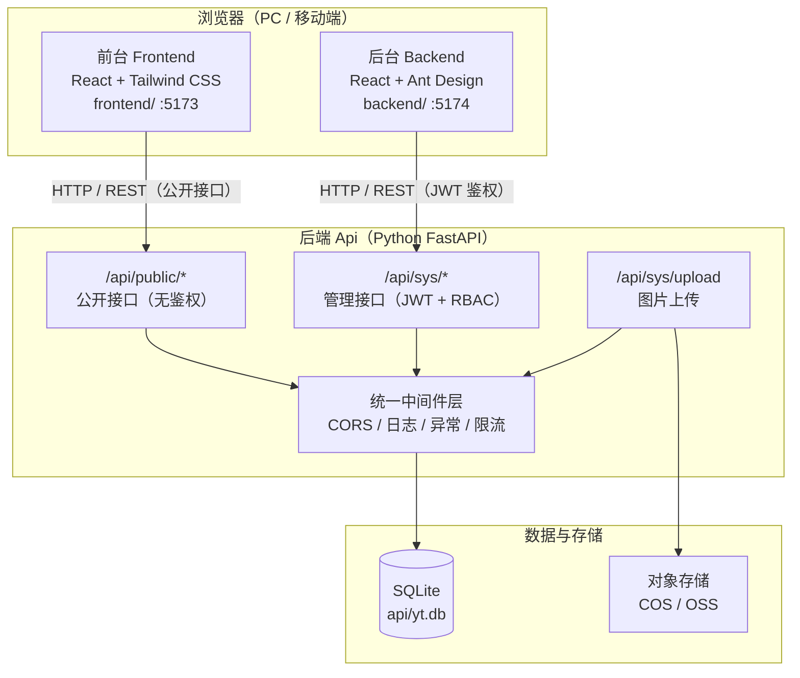
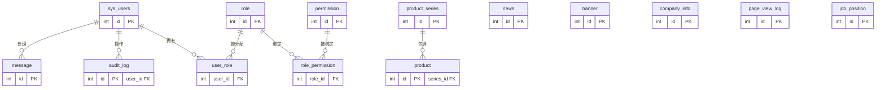
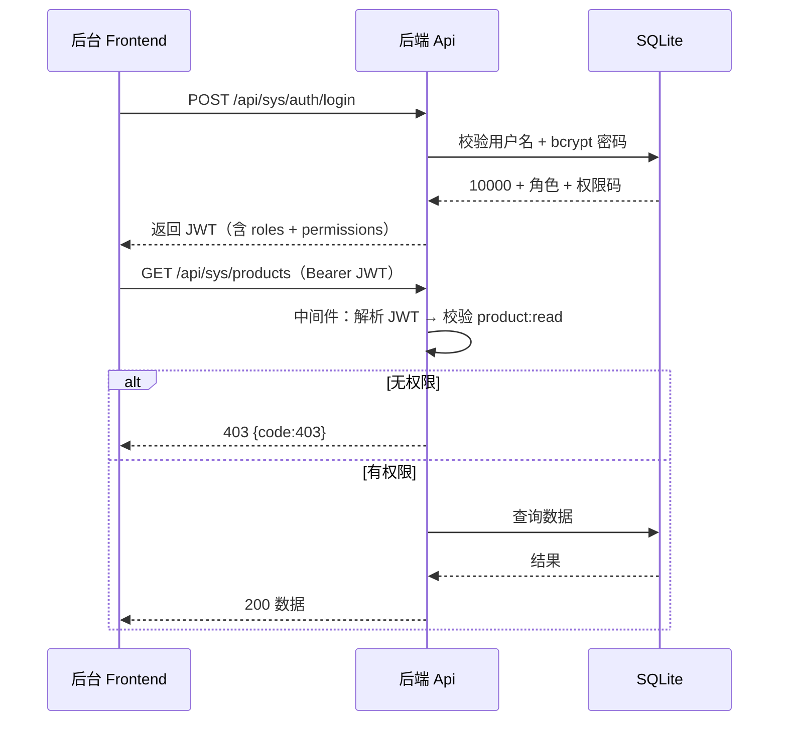
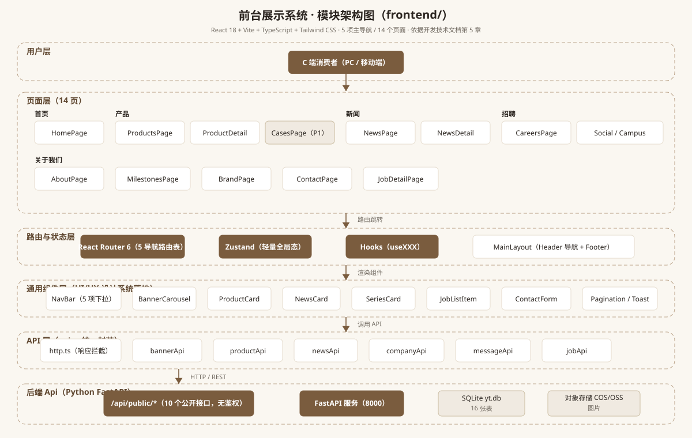
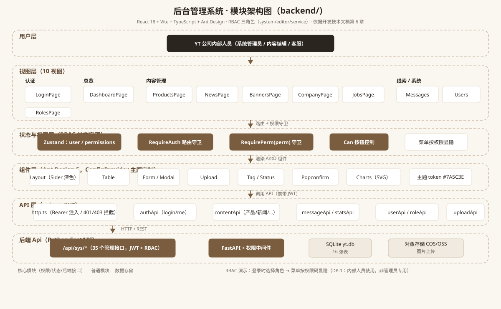
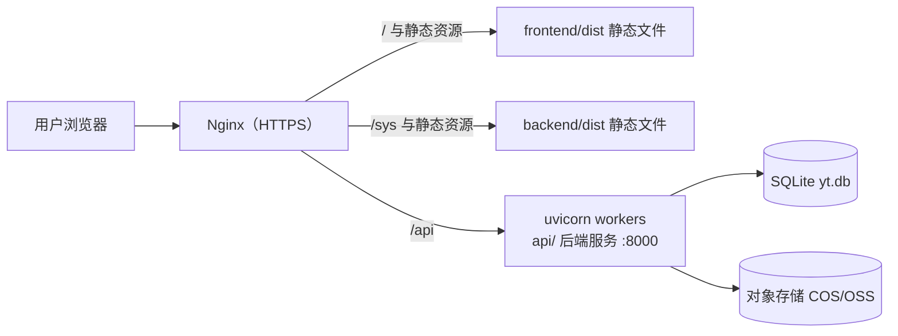

# YT 品牌家具官网 —— 开发技术文档（Development Technical Spec）

| 文档属性 | 内容                                                                                                     |
| ---- | ------------------------------------------------------------------------------------------------------ |
| 文档版本 | v1.7（同步后台 v2.2：登录安全验证码/失败锁定/记住我、banner 投放字段、操作日志接口 /api/sys/audits、audit:read 权限点、敏感信息脱敏返回） |
| 文档状态 | 待评审                                                                                                    |
| 撰写日期 | 2026-08-25                                                                                             |
| 需求依据 | PRD v1.9（docs/PRD-YT品牌家具官网.md，含设计原则章节）                                                                 |
| 设计依据 | UI/UX 设计规范 v1.2（back/UIUX-设计规范-YT家具官网.md）                                                              |
| 前端技术 | React 18 + Vite + TypeScript（前台 Tailwind CSS / 后台 Ant Design）                                          |
| 后端技术 | Python 3.12 + FastAPI + SQLAlchemy + SQLite                                                            |
| 术语约定 | 前台（Frontend，目录 `frontend/`）；后台（Backend，目录 `backend/`，浏览器访问的管理系统）；后端（Api，目录 `api/`，Python FastAPI 对外服务） |

---

## 设计原则（Design Principles）

> 本节与 PRD 「设计原则」章节对齐，是本技术文档及代码实现必须遵守的全局约束。**任何与本原则冲突的字段命名、接口命名或代码措辞均视为修订遗留，须立即修正。**

| 编号       | 原则                          | 说明                                                                                                    | 对应命名                                                                   |
| -------- | --------------------------- | ----------------------------------------------------------------------------------------------------- | ---------------------------------------------------------------------- |
| **DP-1** | 后台是给公司内部人员使用的，不是专门给管理员用的    | 后台管理系统（`backend/`）面向 YT 公司内部人员（系统管理员 / 内容编辑 / 客服），**不限于管理员使用**。文档与代码中不应使用 `Admin` / `管理员` 命名字段、模块或路径。 | 用户表 `sys_users`、角色 `system` / `editor` / `service`、API 路径 `/api/sys/*` |
| **DP-2** | `sys_users` 是用户表，不代表仅供管理员使用 | `sys_users` 表存储**所有内部人员账号**（system / editor / service 三角色）。`sys` 表示"系统内部用户"，与 C 端访客无关，也与管理权限无关。       | 子域 `sys.*`、初始账号 `10000`（纯数字）                                             |

**实现层面的强制约束**：

1. **数据库**：所有表名、字段名、注释一律使用 `sys_*`、`role`、`permission` 等中性命名，禁止 `admin_*` 命名。
2. **API**：管理端统一前缀 `/api/sys/*`；任何模块（如未来新增）不得新建 `/api/admin/*` 路径。
3. **目录结构**：`api/`、`backend/`、`frontend/` 三个目录命名不变；`api/app/routers/sys/`（非 `admin/`）。
4. **前端代码**：路由、组件、store key 禁止 `Admin` 命名；用 RBAC 角色 `system/editor/service` 驱动菜单与按钮显隐。
5. **环境变量**：`INIT_SYSADMIN_PASSWORD`（非 `INIT_ADMIN_PASSWORD`）；初始账号 `10000`（纯数字，非 `admin`）。
6. **部署**：子域名 `sys.yt-domain.com`（非 `admin.*`）；Nginx 反代路径 `/sys`（非 `/admin`）。
7. **文档/UI 措辞**：使用"内部人员 / 系统用户 / 用户管理"代替"管理员 / 账号 / 账号管理"。

---

## 目录

- [设计原则（Design Principles）](#设计原则（design-principles）)
- [1. 概述与总体架构](#1-概述与总体架构)
  - [1.1 系统概述](#11-系统概述)
  - [1.2 总体架构图](#12-总体架构图)
  - [1.3 技术选型](#13-技术选型)
  - [1.4 项目目录结构（Monorepo）](#14-项目目录结构（monorepo）)
  - [1.5 环境要求与端口](#15-环境要求与端口)
- [5. 数据库设计](#5-数据库设计)
  - [5.1 设计约定](#51-设计约定)
  - [5.2 实体关系概览（ER 图）](#52-实体关系概览（er-图）)
  - [5.3.1 系统用户表 sys\_users](#531-系统用户表-sys_users)
  - [5.3.2 角色表 role](#532-角色表-role)
  - [5.3.3 权限点表 permission](#533-权限点表-permission)
  - [5.3.4 用户-角色关联表 user\_role](#534-用户-角色关联表-user_role)
  - [5.3.5 角色-权限关联表 role\_permission](#535-角色-权限关联表-role_permission)
  - [5.3.6 产品系列表 product\_series](#536-产品系列表-product_series)
  - [5.3.7 产品表 product](#537-产品表-product)
  - [5.3.8 新闻表 news](#538-新闻表-news)
  - [5.3.9 轮播图表 banner](#539-轮播图表-banner)
  - [5.3.10 公司介绍单行配置表 company\_info](#5310-公司介绍单行配置表-company_info)
  - [5.3.11 留言线索表 message](#5311-留言线索表-message)
  - [5.3.12 访问统计表 page\_view\_log（按天聚合）](#5312-访问统计表-page_view_log（按天聚合）)
  - [5.3.13 审计日志表 audit\_log](#5313-审计日志表-audit_log)
  - [5.3.14 招聘职位表 job\_position](#5314-招聘职位表-job_position)
  - [5.3.15 部门表 department](#5315-部门表-department)
  - [5.3.16 材质字典表 material](#5316-材质字典表-material)
  - [5.4 索引设计](#54-索引设计)
  - [5.5 预置数据（scripts/init\_db.py）](#55-预置数据（scriptsinit_dbpy）)
  - [5.6 完整 SQLAlchemy ORM 模型（16 张表）](#56-完整-sqlalchemy-orm-模型（16-张表）)
- [3. API 接口设计](#3-api-接口设计)
  - [3.1 通用约定](#31-通用约定)
  - [3.2 RBAC 校验流程](#32-rbac-校验流程)
  - [3.3 公开接口（/api/public/\*，无需鉴权）](#33-公开接口（apipublic，无需鉴权）)
  - [3.4 管理接口（/api/sys/\*，JWT + RBAC）](#34-管理接口（apisys，jwt-rbac）)
- [4. 后端 Api 开发指南（api/）](#4-后端-api-开发指南（api）)
  - [4.1 项目结构](#41-项目结构)
  - [4.2 关键实现要点](#42-关键实现要点)
  - [4.3 启动与初始化](#43-启动与初始化)
  - [4.4 后端测试（pytest）](#44-后端测试（pytest）)
- [5. 前台 Frontend 开发指南（frontend/）](#5-前台-frontend-开发指南（frontend）)
  - [5.0 前台模块架构图](#50-前台模块架构图)
  - [5.1 工程搭建](#51-工程搭建)
  - [5.2 UI/UX token 落地（tailwind 主题 + CSS 变量）](#52-uiux-token-落地（tailwind-主题-css-变量）)
  - [5.3 路由与页面（14 页，对应 UI/UX 4.1）](#53-路由与页面（14-页，对应-uiux-41）)
  - [5.4 API 封装（src/api/）](#54-api-封装（srcapi）)
  - [5.5 关键页面实现要点](#55-关键页面实现要点)
- [6. 后台 Backend 开发指南（backend/）](#6-后台-backend-开发指南（backend）)
  - [6.0 后台模块架构图](#60-后台模块架构图)
  - [6.1 工程搭建](#61-工程搭建)
  - [6.2 Ant Design 主题定制（对齐 UI/UX token）](#62-ant-design-主题定制（对齐-uiux-token）)
  - [6.3 路由与布局（11 视图，对应 UI/UX 4.2）](#63-路由与布局（11-视图，对应-uiux-42）)
  - [6.4 RBAC 前端实现（对应 PRD US-15 / G-18）](#64-rbac-前端实现（对应-prd-us-15-g-18）)
  - [6.5 核心页面实现要点](#65-核心页面实现要点)
- [7. 前后端联调规范](#7-前后端联调规范)
  - [7.1 联调约定](#71-联调约定)
  - [7.2 测试策略](#72-测试策略)
  - [7.3 验收对照（PRD 里程碑阶段 5）](#73-验收对照（prd-里程碑阶段-5）)
  - [7.4 开发流程与任务拆解（对应 PRD 2 周 MVP）](#74-开发流程与任务拆解（对应-prd-2-周-mvp）)
- [9. 部署方案](#9-部署方案)
  - [9.1 生产部署架构](#91-生产部署架构)
  - [8.2 环境变量清单](#82-环境变量清单)
  - [8.3 运维项（对应 PRD NFR）](#83-运维项（对应-prd-nfr）)
- [8. 编码规范](#8-编码规范)
  - [8.1 命名规范（去 admin 化铁则）](#81-命名规范（去-admin-化铁则）)
  - [8.2 代码风格](#82-代码风格)
  - [8.3 安全规范（对照 PRD NFR，原 9. 安全实现清单合并）](#83-安全规范（对照-prd-nfr，原-9-安全实现清单合并）)
  - [8.4 Git 提交规范](#84-git-提交规范)
  - [8.5 测试规范](#85-测试规范)
- [10. 附录](#10-附录)
  - [10.1 依赖版本建议](#101-依赖版本建议)
  - [10.2 常用命令](#102-常用命令)
  - [10.3 接口一览（数量核对）](#103-接口一览（数量核对）)
- [11. 修订记录](#11-修订记录)

---

## 1. 概述与总体架构

### 1.1 系统概述

YT 品牌家具官网由**前台展示系统、后台管理系统、后端 Api 服务**三部分组成：

- **前台（Frontend）**：面向 C 端消费者的品牌展示官网，主导航 5 项（首页 / 产品 / 新闻 / 招聘入口 / 关于我们），无在线交易、无用户注册；
- **后台（Backend）**：内部内容管理系统（产品 / 新闻 / 轮播图 / 公司介绍 / 职位 / 留言 / 统计 / 用户与角色），单系统管理员 + RBAC 三角色；
- **后端（Api）**：统一 REST API 服务，公开接口（`/api/public/*`）与管理接口（`/api/sys/*`）分区，管理接口 JWT + RBAC 双层鉴权。

### 1.2 总体架构图



### 1.3 技术选型

| 层    | 选型              | 版本建议    | 说明                   |
| ---- | --------------- | ------- | -------------------- |
| 前端框架 | React           | 18.x    | 函数组件 + Hooks         |
| 构建工具 | Vite            | 5.x     | 前后台两个独立工程            |
| 语言   | TypeScript      | 5.x     | 全量类型化                |
| 前台样式 | Tailwind CSS    | 3.4.x   | token 映射为 CSS 变量     |
| 后台组件 | Ant Design      | 5.x     | ConfigProvider 主题定制  |
| 路由   | React Router    | 6.x     | 前后台独立路由              |
| 状态   | Zustand         | 4.x     | 轻量全局状态（权限 / 用户）      |
| HTTP | axios           | 1.x     | 统一封装                 |
| 后端框架 | FastAPI         | 0.115.x | 自动 OpenAPI 文档（/docs） |
| ORM  | SQLAlchemy 2.x  | 2.0.x   | 声明式模型                |
| 数据库  | SQLite          | 3.x     | 单文件 `yt.db`          |
| 密码   | passlib[bcrypt] | 1.7.x   | bcrypt 哈希            |
| JWT  | PyJWT           | 2.x     | HS256，24h            |
| 校验   | Pydantic v2     | 2.x     | 请求 / 响应模型            |
| 数据验证 | email-validator | —       | 邮箱格式校验               |
| 测试   | pytest + httpx  | —       | 后端接口测试               |

### 1.4 项目目录结构（Monorepo）

```
D:\家具网站\
├── docs\                      # 文档（PRD / 技术文档）
├── back\                      # 原型与设计规范
├── api\                       # 后端 Api（FastAPI 微服务）
│   ├── app\
│   │   ├── main.py            # 应用入口（FastAPI 实例、中间件、路由注册）
│   │   ├── config.py          # 配置（pydantic-settings）
│   │   ├── database.py        # SQLAlchemy engine / session / Base
│   │   ├── models\            # ORM 模型（16 张表）
│   │   ├── schemas\           # Pydantic 模型（请求 / 响应）
│   │   ├── routers\
│   │   │   ├── public\        # 公开接口（banners/series/products/news/company/messages/jobs）
│   │   │   └── sys\           # 管理接口（auth/users/roles/permissions/.../upload）
│   │   ├── middleware\        # JWT 鉴权 + RBAC 校验中间件
│   │   ├── services\          # 业务逻辑（统计、上传、防刷等）
│   │   └── utils\             # 工具（响应封装、分页、时间）
│   ├── scripts\
│   │   ├── init_db.py         # 建表 + 种子数据（10000 + 4 部门 + 3 角色 + 16 权限点）
│   │   └── backup.py          # SQLite 每日备份
│   ├── tests\                 # pytest 测试
│   ├── requirements.txt
│   └── yt.db                  # SQLite 库文件（运行生成）
├── frontend\                  # 前台（React + Tailwind）
│   ├── src\
│   │   ├── api\               # axios 封装 + 各模块 API
│   │   ├── assets\            # 样式（tailwind.css + tokens.css）
│   │   ├── components\        # 通用组件（Header/Nav/Footer/Card...）
│   │   ├── layouts\           # 页面布局
│   │   ├── pages\             # 14 个页面组件
│   │   ├── router\            # 路由配置
│   │   ├── hooks\             # 自定义 hooks
│   │   └── main.tsx
│   ├── index.html
│   ├── tailwind.config.js
│   └── vite.config.ts         # dev proxy → http://localhost:8000
└── backend\                   # 后台（React + Ant Design）
    ├── src\
    │   ├── api\               # axios 封装（JWT 注入）
    │   ├── components\        # 通用组件（表格/表单/弹窗/上传）
    │   ├── layouts\           # AdminLayout（侧边栏+顶栏）
    │   ├── pages\             # 10 个视图
    │   ├── router\            # 路由 + 权限守卫
    │   ├── store\             # Zustand（user / permissions）
    │   ├── hooks\
    │   └── main.tsx
    ├── index.html
    └── vite.config.ts         # dev proxy → http://localhost:8000
```

### 1.5 环境要求与端口

| 子项目       | 开发端口 | 说明                                          |
| --------- | ---- | ------------------------------------------- |
| api/      | 8000 | `uvicorn app.main:app --reload --port 8000` |
| frontend/ | 5173 | `npm run dev`                               |
| backend/  | 5174 | `npm run dev`                               |

---

## 5. 数据库设计

### 5.1 设计约定

| 约定      | 规则                                                                     |
| ------- | ---------------------------------------------------------------------- |
| 主键      | `INTEGER PRIMARY KEY AUTOINCREMENT`                                    |
| 时间戳     | 所有业务表含 `created_at`、`updated_at`（`TEXT DEFAULT CURRENT_TIMESTAMP`，ISO 8601 字符串） |
| JSON 字段 | 存储为 `TEXT`，读写时 JSON 序列化 / 反序列化                                         |
| 状态字段    | `status INTEGER`：0 = 停用/下架/关闭，1 = 启用/上架/招聘中                            |
| 外键      | 建表时启用 `PRAGMA foreign_keys=ON`                                         |
| 软删除     | MVP 不做软删除，删除为物理删除（留言删除为 P1）                                            |
| 索引      | 常用查询列建索引（见 2.16）                                                       |

### 5.2 实体关系概览（ER 图）


> 上图为本项目 **ER 图（16 张表全量关系）**，SVG 源文件：`docs/images/er-diagram.svg`。图例：`PK` 主键、`FK` 外键、`UNIQUE` 唯一；实体框按「RBAC 权限域 / 产品域 / 内容管理域 / 线索与统计域」分组；连线标注 1:N 基数。
>
> 若渲染环境不支持 SVG，可参考以下 Mermaid 等价源码：



### 5.3.1 系统用户表 sys_users

| 字段                      | 类型       | 约束              | 说明                                   |
| ----------------------- | -------- | --------------- | ------------------------------------ |
| id                      | INTEGER  | PK              | 主键                                   |
| username                | TEXT     | UNIQUE NOT NULL CHECK (username GLOB '[0-9]*') | 用户名（**纯数字**，登录用，不可改）                  |
| name                    | TEXT     | NOT NULL        | 姓名                                   |
| nickname                | TEXT     | NULL            | 昵称                                   |
| password_hash           | TEXT     | NOT NULL        | bcrypt 哈希                            |
| phone                   | TEXT     | UNIQUE CHECK (length(phone) = 11) | 手机号（11 位）                          |
| id_card                 | TEXT     | UNIQUE CHECK (length(id_card) IN (15, 18)) | 身份证号（15 / 18 位）                    |
| address                 | TEXT     | NULL            | 联系地址                                |
| gender                  | INTEGER  | DEFAULT 0       | 0 未知 / 1 男 / 2 女                  |
| department_id           | INTEGER  | NULL（FK → department.id） | 所属部门（部门删除后置 NULL）                  |
| status                  | INTEGER  | DEFAULT 1       | 0 停用 / 1 启用                          |
| last_login_at           | TEXT     | NULL            | 最后登录时间                               |
| last_login_ip           | TEXT     | NULL            | 最后登录 IP                              |
| created_at   | INTEGER  | FK → sys_users.id     | 创建人（自引用，预置账号 NULL）     |
| created_date | TEXT     | NOT NULL DEFAULT CURRENT_TIMESTAMP | 创建时间    |
| updated_at   | INTEGER  | FK → sys_users.id     | 修改人（预置账号 NULL）     |
| updated_date | TEXT     | NOT NULL DEFAULT CURRENT_TIMESTAMP | 修改时间    |
| is_activate  | INTEGER  | NOT NULL DEFAULT 1    | 1 激活 / 0 禁用    |

### 5.3.2 角色表 role

| 字段                      | 类型       | 约束              | 说明                             |
| ----------------------- | -------- | --------------- | ------------------------------ |
| id                      | INTEGER  | PK              | 主键                             |
| code                    | TEXT     | UNIQUE NOT NULL | 角色编码：system / editor / service |
| name                    | TEXT     | NOT NULL        | 角色名称                           |
| description             | TEXT     | NULL            | 角色说明                           |
| is_preset               | INTEGER  | DEFAULT 1       | 1 预设（不可删除）                     |
| created_at   | INTEGER  | FK → sys_users.id     | 创建人（预置数据 NULL）     |
| created_date | TEXT     | NOT NULL DEFAULT CURRENT_TIMESTAMP | 创建时间    |
| updated_at   | INTEGER  | FK → sys_users.id     | 修改人（预置数据 NULL）     |
| updated_date | TEXT     | NOT NULL DEFAULT CURRENT_TIMESTAMP | 修改时间    |
| is_activate  | INTEGER  | NOT NULL DEFAULT 1    | 1 激活 / 0 禁用    |

### 5.3.3 权限点表 permission

| 字段        | 类型      | 约束              | 说明                                                                      |
| --------- | ------- | --------------- | ----------------------------------------------------------------------- |
| id        | INTEGER | PK              | 主键                                                                      |
| code      | TEXT    | UNIQUE NOT NULL | 如 `product:read`                                                        |
| name      | TEXT    | NOT NULL        | 权限名称                                                                    |
| module    | TEXT    | NOT NULL        | product / news / banner / company / job / message / user / role / stats / audit |
| action    | TEXT    | NOT NULL        | read / write                                                            |
| is_preset | INTEGER | DEFAULT 1       | 1 预设                                                                    |
| created_at   | INTEGER  | FK → sys_users.id     | 创建人（预置数据 NULL）     |
| created_date | TEXT     | NOT NULL DEFAULT CURRENT_TIMESTAMP | 创建时间    |
| updated_at   | INTEGER  | FK → sys_users.id     | 修改人（预置数据 NULL）     |
| updated_date | TEXT     | NOT NULL DEFAULT CURRENT_TIMESTAMP | 修改时间    |
| is_activate  | INTEGER  | NOT NULL DEFAULT 1    | 1 激活 / 0 禁用    |

**种子数据：17 个权限点**（`product / news / banner / company / job / message / user` 各 read+write，`role:read`、`stats:read`、`audit:read`）。

### 5.3.4 用户-角色关联表 user_role

| 字段      | 类型      | 约束                     |
| ------- | ------- | ---------------------- |
| user_id | INTEGER | FK → sys_users.id，联合主键 |
| role_id | INTEGER | FK → role.id，联合主键      |
| created_at   | INTEGER  | FK → sys_users.id     |
| created_date | TEXT     | NOT NULL DEFAULT CURRENT_TIMESTAMP |
| updated_at   | INTEGER  | FK → sys_users.id     |
| updated_date | TEXT     | NOT NULL DEFAULT CURRENT_TIMESTAMP |
| is_activate  | INTEGER  | NOT NULL DEFAULT 1    |

### 5.3.5 角色-权限关联表 role_permission

| 字段            | 类型      | 约束                      |
| ------------- | ------- | ----------------------- |
| role_id       | INTEGER | FK → role.id，联合主键       |
| permission_id | INTEGER | FK → permission.id，联合主键 |
| created_at   | INTEGER  | FK → sys_users.id     |
| created_date | TEXT     | NOT NULL DEFAULT CURRENT_TIMESTAMP |
| updated_at   | INTEGER  | FK → sys_users.id     |
| updated_date | TEXT     | NOT NULL DEFAULT CURRENT_TIMESTAMP |
| is_activate  | INTEGER  | NOT NULL DEFAULT 1    |

**默认权限矩阵（种子数据）**

| 权限 \ 角色                                              | system | editor | service |
| ---------------------------------------------------- | :----: | :----: | :-----: |
| product / news / banner / company / job (read+write) |    ✓   |    ✓   |    —    |
| message (read+write)                                 |    ✓   |    —   |    ✓    |
| user (read+write)                                    |    ✓   |    —   |    —    |
| role:read                                            |    ✓   |    —   |    —    |
| stats:read                                           |    ✓   |    ✓   |    ✓    |
| audit:read                                           |    ✓   |    —   |    —    |

### 5.3.6 产品系列表 product_series

| 字段                      | 类型       | 约束        | 说明            |
| ----------------------- | -------- | --------- | ------------- |
| id                      | INTEGER  | PK        | 主键            |
| name                    | TEXT     | NOT NULL  | 系列名称（如：云栖、简序） |
| description             | TEXT     | NULL      | 系列简介          |
| cover_image             | TEXT     | NULL      | 封面图 URL       |
| sort_order              | INTEGER  | DEFAULT 0 | 排序（升序）        |
| status                  | INTEGER  | DEFAULT 1 | 0 停用 / 1 启用   |
| created_at   | INTEGER  | FK → sys_users.id     | 创建人（预置数据 NULL）     |
| created_date | TEXT     | NOT NULL DEFAULT CURRENT_TIMESTAMP | 创建时间    |
| updated_at   | INTEGER  | FK → sys_users.id     | 修改人（预置数据 NULL）     |
| updated_date | TEXT     | NOT NULL DEFAULT CURRENT_TIMESTAMP | 修改时间    |
| is_activate  | INTEGER  | NOT NULL DEFAULT 1    | 1 激活 / 0 禁用    |

### 5.3.7 产品表 product

| 字段                      | 类型       | 约束                     | 说明                  |
| ----------------------- | -------- | ---------------------- | ------------------- |
| id                      | INTEGER  | PK                     | 主键                  |
| series_id               | INTEGER  | FK → product_series.id | 所属系列                |
| name                    | TEXT     | NOT NULL               | 产品名称                |
| model                   | TEXT     | NULL                   | 型号（如 YQ-SF-3108）    |
| category                | TEXT     | NOT NULL               | 分类名称：民用 / 办公 / 软体 / 定制 |
| category_code           | INTEGER  | NOT NULL DEFAULT 1 CHECK (category_code IN (1,2,3,4)) | 分类编号：1 民用 / 2 办公 / 3 软体 / 4 定制 |
| material_id             | INTEGER  | FK → material.id（ON DELETE SET NULL） | 材质（关联材质字典 `material`） |
| product_type            | TEXT     | NOT NULL CHECK (product_type IN ('床','沙发','桌椅','柜体','衣柜','茶几','床垫','其他')) | 产品类型（枚举，可扩展） |
| description             | TEXT     | NULL                   | 图文描述（富文本 HTML）      |
| params                  | TEXT     | NULL                   | JSON 键值对（尺寸/颜色等；材质独立为 `material` 表） |
| original_price          | REAL     | NULL                   | 原价（元）              |
| discount_price          | REAL     | NULL                   | 折扣价（元；空表示无折扣）     |
| cover_image             | TEXT     | NULL                   | 主图 URL              |
| images                  | TEXT     | NULL                   | JSON 数组（详情图 URL 列表） |
| is_customizable         | INTEGER  | DEFAULT 0              | 是否定制：0 否 / 1 是       |
| sort_order              | INTEGER  | DEFAULT 0              | 排序                  |
| status                  | INTEGER  | DEFAULT 1              | 0 下架 / 1 上架         |
| view_count              | INTEGER  | DEFAULT 0              | 浏览量                 |
| created_at   | INTEGER  | FK → sys_users.id     | 创建人（预置数据 NULL）     |
| created_date | TEXT     | NOT NULL DEFAULT CURRENT_TIMESTAMP | 创建时间    |
| updated_at   | INTEGER  | FK → sys_users.id     | 修改人（预置数据 NULL）     |
| updated_date | TEXT     | NOT NULL DEFAULT CURRENT_TIMESTAMP | 修改时间    |
| is_activate  | INTEGER  | NOT NULL DEFAULT 1    | 1 激活 / 0 禁用    |

### 5.3.8 新闻表 news

| 字段                      | 类型       | 约束                   | 说明                                  |
| ----------------------- | -------- | -------------------- | ----------------------------------- |
| id                      | INTEGER  | PK                   | 主键                                  |
| title                   | TEXT     | NOT NULL             | 标题                                  |
| summary                 | TEXT     | NULL                 | 摘要                                  |
| category                | TEXT     | DEFAULT 'enterprise' | P1：enterprise（企业新闻）/ industry（行业资讯） |
| cover_image             | TEXT     | NULL                 | 封面图 URL                             |
| content                 | TEXT     | NOT NULL             | 正文（富文本 HTML）                        |
| publish_time            | TEXT | NOT NULL             | 发布时间                                |
| view_count              | INTEGER  | DEFAULT 0            | 浏览量                                 |
| created_at   | INTEGER  | FK → sys_users.id     | 创建人（预置数据 NULL）     |
| created_date | TEXT     | NOT NULL DEFAULT CURRENT_TIMESTAMP | 创建时间    |
| updated_at   | INTEGER  | FK → sys_users.id     | 修改人（预置数据 NULL）     |
| updated_date | TEXT     | NOT NULL DEFAULT CURRENT_TIMESTAMP | 修改时间    |
| is_activate  | INTEGER  | NOT NULL DEFAULT 1    | 1 激活 / 0 禁用    |

### 5.3.9 轮播图表 banner

| 字段                      | 类型       | 约束        | 说明          |
| ----------------------- | -------- | --------- | ----------- |
| id                      | INTEGER  | PK        | 主键          |
| group_code              | TEXT     | DEFAULT 'home' | 分组编码：home / category / mobile / popup / float |
| title                   | TEXT     | NULL      | 标题          |
| subtitle                | TEXT     | NULL      | 副标题        |
| image                   | TEXT     | NOT NULL  | 图片 URL（PC 端） |
| image_mobile            | TEXT     | NULL      | 移动端图片 URL |
| link_type               | TEXT     | DEFAULT 'internal' | internal / external |
| link_target             | TEXT     | NULL      | 链接目标（内部路由或外部 URL） |
| button_text             | TEXT     | NULL      | 按钮文字 |
| button_color            | TEXT     | NULL      | 按钮颜色（色值） |
| platforms               | TEXT     | NULL      | JSON 数组：["web","app","wechat"] |
| start_date              | TEXT     | NULL      | 上线时间（ISO 8601） |
| end_date                | TEXT     | NULL      | 下线时间（ISO 8601） |
| sort_order              | INTEGER  | DEFAULT 0 | 组内排序 |
| status                  | INTEGER  | DEFAULT 1 | 0 停用 / 1 启用 |
| impressions             | INTEGER  | DEFAULT 0 | 累计曝光 PV |
| clicks                  | INTEGER  | DEFAULT 0 | 累计点击 |
| created_at   | INTEGER  | FK → sys_users.id     | 创建人（预置数据 NULL）     |
| created_date | TEXT     | NOT NULL DEFAULT CURRENT_TIMESTAMP | 创建时间    |
| updated_at   | INTEGER  | FK → sys_users.id     | 修改人（预置数据 NULL）     |
| updated_date | TEXT     | NOT NULL DEFAULT CURRENT_TIMESTAMP | 修改时间    |
| is_activate  | INTEGER  | NOT NULL DEFAULT 1    | 1 激活 / 0 禁用    |

> 说明：`ctr` = clicks / impressions 实时计算不落库；前台仅展示 `status=1` 且当前时间在 `start_date ~ end_date` 内的记录（无上下线时间视为长期）。

### 5.3.10 公司介绍单行配置表 company_info

| 字段                                       | 类型       | 约束           | 说明                                |
| ---------------------------------------- | -------- | ------------ | --------------------------------- |
| id                                       | INTEGER  | PK DEFAULT 1 | 固定 1 行                            |
| slogan                                   | TEXT     | NULL         | 品牌 Slogan                         |
| intro                                    | TEXT     | NULL         | 企业简介（富文本）                         |
| milestones                               | TEXT     | NULL         | JSON：[{year, event}]              |
| honors                                   | TEXT     | NULL         | JSON：[{title, image}]             |
| concepts                                 | TEXT     | NULL         | JSON：[{title, description, icon}] |
| address / phone / email / business_hours | TEXT     | NULL         | 联系信息                              |
| job_email / job_phone                    | TEXT     | NULL         | 招聘投递邮箱 / 电话（职位详情页展示）              |
| created_at   | INTEGER  | FK → sys_users.id     | 创建人（预置数据 NULL）     |
| created_date | TEXT     | NOT NULL DEFAULT CURRENT_TIMESTAMP | 创建时间    |
| updated_at   | INTEGER  | FK → sys_users.id     | 修改人（预置数据 NULL）     |
| updated_date | TEXT     | NOT NULL DEFAULT CURRENT_TIMESTAMP | 修改时间    |
| is_activate  | INTEGER  | NOT NULL DEFAULT 1    | 1 激活 / 0 禁用    |

### 5.3.11 留言线索表 message

| 字段         | 类型       | 约束                | 说明                          |
| ---------- | -------- | ----------------- | --------------------------- |
| id         | INTEGER  | PK                | 主键                          |
| name       | TEXT     | NOT NULL          | 姓名                          |
| phone      | TEXT     | NOT NULL          | 联系电话                        |
| content    | TEXT     | NOT NULL          | 留言内容                        |
| source     | TEXT     | DEFAULT 'contact' | contact（普通）/ join（加盟 P1）    |
| status     | TEXT     | DEFAULT 'new'     | new / contacted / done      |
| ip         | TEXT     | NULL              | 提交 IP（取 X-Forwarded-For 首段） |
| created_at   | INTEGER  | FK → sys_users.id     | 创建人（预置数据 NULL）     |
| created_date | TEXT     | NOT NULL DEFAULT CURRENT_TIMESTAMP | 创建时间    |
| updated_at   | INTEGER  | FK → sys_users.id     | 修改人（预置数据 NULL）     |
| updated_date | TEXT     | NOT NULL DEFAULT CURRENT_TIMESTAMP | 修改时间    |
| is_activate  | INTEGER  | NOT NULL DEFAULT 1    | 1 激活 / 0 禁用    |

### 5.3.12 访问统计表 page_view_log（按天聚合）

| 字段         | 类型                                | 约束        | 说明                            |
| ---------- | --------------------------------- | --------- | ----------------------------- |
| id         | INTEGER                           | PK        | 主键                            |
| page_type  | TEXT                              | NOT NULL  | home / product / news / other |
| target_id  | INTEGER                           | NULL      | 产品 / 新闻 ID                    |
| view_date  | TEXT                             | NOT NULL  | 访问日期（YYYY-MM-DD）                  |
| view_count | INTEGER                           | DEFAULT 0 | 当日计数                          |
| created_at   | INTEGER  | FK → sys_users.id     | 创建人（预置数据 NULL）     |
| created_date | TEXT     | NOT NULL DEFAULT CURRENT_TIMESTAMP | 创建时间    |
| updated_at   | INTEGER  | FK → sys_users.id     | 修改人（预置数据 NULL）     |
| updated_date | TEXT     | NOT NULL DEFAULT CURRENT_TIMESTAMP | 修改时间    |
| is_activate  | INTEGER  | NOT NULL DEFAULT 1    | 1 激活 / 0 禁用    |
| UNIQUE     | (page_type, target_id, view_date) | 唯一        | 聚合键                           |

### 5.3.13 审计日志表 audit_log

| 字段          | 类型       | 约束                | 说明                                                                                  |
| ----------- | -------- | ----------------- | ----------------------------------------------------------------------------------- |
| id          | INTEGER  | PK                | 主键                                                                                  |
| user_id     | INTEGER  | FK → sys_users.id | 操作人                                                                                 |
| username    | TEXT     | NOT NULL          | 操作人用户名（冗余）                                                                          |
| action      | TEXT     | NOT NULL          | login / logout / create / update / delete / status_change / upload / password_reset / export / permission_change |
| resource    | TEXT     | NOT NULL          | product / news / banner / company / job / message / user / role / auth / audit              |
| resource_id | INTEGER  | NULL              | 资源 ID                                                                               |
| detail      | TEXT     | NULL              | JSON 变更详情                                                                           |
| ip          | TEXT     | NULL              | 操作 IP                                                                               |
| user_agent  | TEXT     | NULL              | UA                                                                                  |
| status      | INTEGER  | DEFAULT 1         | 1 成功 / 0 失败                                                                         |
| created_at   | INTEGER  | FK → sys_users.id     | 创建人（预置数据 NULL）     |
| created_date | TEXT     | NOT NULL DEFAULT CURRENT_TIMESTAMP | 创建时间    |
| updated_at   | INTEGER  | FK → sys_users.id     | 修改人（预置数据 NULL）     |
| updated_date | TEXT     | NOT NULL DEFAULT CURRENT_TIMESTAMP | 修改时间    |
| is_activate  | INTEGER  | NOT NULL DEFAULT 1    | 1 激活 / 0 禁用    |

### 5.3.14 招聘职位表 job_position

| 字段                      | 类型       | 约束        | 说明                         |
| ----------------------- | -------- | --------- | -------------------------- |
| id                      | INTEGER  | PK        | 主键                         |
| title                   | TEXT     | NOT NULL  | 职位名称                       |
| job_type                | TEXT     | NOT NULL  | social（社会招聘）/ campus（校园招聘） |
| department              | TEXT     | NULL      | 部门                         |
| location                | TEXT     | NOT NULL  | 工作地点                       |
| headcount               | INTEGER  | NULL      | 招聘人数（可空）                   |
| description             | TEXT     | NULL      | 职位描述 / 职责（富文本 HTML）        |
| requirement             | TEXT     | NULL      | 任职要求（富文本 HTML）             |
| contact_email           | TEXT     | NULL      | 投递邮箱（缺省用 company_info）     |
| contact_phone           | TEXT     | NULL      | 投递电话（缺省用 company_info）     |
| publish_time            | TEXT | NOT NULL  | 发布时间                       |
| status                  | INTEGER  | DEFAULT 1 | 0 已关闭 / 1 招聘中              |
| view_count              | INTEGER  | DEFAULT 0 | 浏览量                        |
| created_at   | INTEGER  | FK → sys_users.id     | 创建人（预置数据 NULL）     |
| created_date | TEXT     | NOT NULL DEFAULT CURRENT_TIMESTAMP | 创建时间    |
| updated_at   | INTEGER  | FK → sys_users.id     | 修改人（预置数据 NULL）     |
| updated_date | TEXT     | NOT NULL DEFAULT CURRENT_TIMESTAMP | 修改时间    |
| is_activate  | INTEGER  | NOT NULL DEFAULT 1    | 1 激活 / 0 禁用    |

### 5.3.15 部门表 department
内部组织架构基础表（行政部 / 市场部 / 销售部 / 生产部等），被 `sys_users.department_id` 引用。

| 字段                      | 类型       | 约束              | 说明                          |
| ----------------------- | -------- | --------------- | --------------------------- |
| id                      | INTEGER  | PK              | 主键                          |
| name                    | TEXT     | UNIQUE NOT NULL | 部门名称                        |
| sort_order              | INTEGER  | DEFAULT 0       | 排序（升序）                      |
| created_at   | INTEGER  | FK → sys_users.id     | 创建人（预置数据 NULL）     |
| created_date | TEXT     | NOT NULL DEFAULT CURRENT_TIMESTAMP | 创建时间    |
| updated_at   | INTEGER  | FK → sys_users.id     | 修改人（预置数据 NULL）     |
| updated_date | TEXT     | NOT NULL DEFAULT CURRENT_TIMESTAMP | 修改时间    |
| is_activate  | INTEGER  | NOT NULL DEFAULT 1    | 1 激活 / 0 禁用    |

- 外键关联：被 `sys_users.department_id` 引用（1:N，ON DELETE SET NULL）
- 种子数据：行政部、市场部、销售部、生产部

### 5.3.16 材质字典表 material
产品材质的字典表，供 `product.material_id` 关联引用（独立成表便于统一维护与筛选）。

| 字段                      | 类型       | 约束              | 说明                          |
| ----------------------- | -------- | --------------- | --------------------------- |
| id                      | INTEGER  | PK              | 主键                          |
| code                    | TEXT     | UNIQUE NOT NULL | 材质编号（如 wood / fabric / leather / metal） |
| name                    | TEXT     | NOT NULL        | 材质名称（如实木 / 布艺 / 真皮 / 金属）         |
| sort_order              | INTEGER  | DEFAULT 0       | 排序（升序）                      |
| status                  | INTEGER  | DEFAULT 1       | 0 停用 / 1 启用                  |
| created_at   | INTEGER  | FK → sys_users.id     | 创建人（预置数据 NULL）     |
| created_date | TEXT     | NOT NULL DEFAULT CURRENT_TIMESTAMP | 创建时间    |
| updated_at   | INTEGER  | FK → sys_users.id     | 修改人（预置数据 NULL）     |
| updated_date | TEXT     | NOT NULL DEFAULT CURRENT_TIMESTAMP | 修改时间    |
| is_activate  | INTEGER  | NOT NULL DEFAULT 1    | 1 激活 / 0 禁用    |

- 外键关联：被 `product.material_id` 引用（1:N，ON DELETE SET NULL）
- 种子数据：实木、布艺、真皮、金属、岩板、玻璃

### 5.4 索引设计

```sql
CREATE INDEX idx_product_series   ON product(series_id);
CREATE INDEX idx_product_status   ON product(status, sort_order);
CREATE INDEX idx_product_cat      ON product(category);
CREATE INDEX idx_product_material  ON product(material_id);
CREATE INDEX idx_news_publish     ON news(publish_time DESC);
CREATE INDEX idx_news_category    ON news(category);
CREATE INDEX idx_job_type_status  ON job_position(job_type, status);
CREATE INDEX idx_msg_status       ON message(status, created_at DESC);
CREATE INDEX idx_pv_agg           ON page_view_log(page_type, view_date);
CREATE INDEX idx_audit_created    ON audit_log(created_at DESC);
CREATE INDEX idx_user_role_uid    ON user_role(user_id);
CREATE INDEX idx_role_perm_rid    ON role_permission(role_id);
CREATE INDEX idx_sys_users_dept   ON sys_users(department_id);
```

### 5.5 预置数据（scripts/init_db.py）

1. 建表（`Base.metadata.create_all`）；
2. 幂等写入：
   - 4 个预设部门（行政部 / 市场部 / 销售部 / 生产部）
   - 初始管理员账号 `username='10000'`（**纯数字**；`sys_users.username` 有 `GLOB '[0-9]*'` CHECK 约束；bcrypt 密码由环境变量 `INIT_SYSADMIN_PASSWORD` 注入，要求首次登录修改）
   - 3 个预设角色（system / editor / service）
   - 16 个预设权限点 + 默认权限矩阵
   - company_info 初始行
3. 预置示例轮播图 / 系列（可选，便于联调）。

### 5.6 完整 SQLAlchemy ORM 模型（16 张表）

> 以下 16 张表采用 **SQLAlchemy 1.x 风格**（`Column(...)` 声明式），与 5.3.1~5.3.16 字段表、建表 SQL 一一对应。文件路径建议：`api/app/models/__init__.py` 集中导出。

#### 2.18.1 sys_users（系统用户表）

```python
class User(Base):
    __tablename__ = "sys_users"
    __table_args__ = (
        CheckConstraint("username GLOB '[0-9]*'", name="ck_users_username_digits"),
        CheckConstraint("length(phone) = 11", name="ck_users_phone_len"),
        CheckConstraint("length(id_card) IN (15, 18)", name="ck_users_id_card_len"),
    )

    id = Column(Integer, primary_key=True, autoincrement=True, comment="主键")
    username = Column(String(20), unique=True, nullable=False, comment="登录用户名（**纯数字**，5~20 位）")
    name = Column(String(50), nullable=False, comment="姓名")
    nickname = Column(String(50), nullable=True, comment="昵称")
    password_hash = Column(String(255), nullable=False, comment="bcrypt 哈希")
    phone = Column(String(11), unique=True, nullable=True, comment="手机号（11 位）")
    id_card = Column(String(18), unique=True, nullable=True, comment="身份证号（15 / 18 位）")
    address = Column(String(255), nullable=True, comment="联系地址")
    gender = Column(Integer, default=0, comment="0 未知 / 1 男 / 2 女")
    department_id = Column(Integer, ForeignKey("department.id"), nullable=True, comment="所属部门（部门删除后置 NULL）")
    status = Column(Integer, default=1, comment="0 停用 / 1 启用")
    last_login_at = Column(DateTime, nullable=True, comment="最后登录时间")
    last_login_ip = Column(String(45), nullable=True, comment="最后登录 IP（IPv6 安全）")
    created_at = Column(Integer, ForeignKey("sys_users.id"), nullable=True, comment="创建人 sys_users.id（预置数据 NULL）")
    created_date = Column(DateTime, default=datetime.utcnow, comment="创建时间")
    updated_at = Column(Integer, ForeignKey("sys_users.id"), nullable=True, comment="修改人 sys_users.id（预置数据 NULL）")
    updated_date = Column(DateTime, default=datetime.utcnow, onupdate=datetime.utcnow, comment="修改时间")
    is_activate = Column(Integer, default=1, comment="1 激活 / 0 禁用")

    department = relationship("Department", lazy="selectin")
    roles = relationship("Role", secondary="user_role", back_populates="users", lazy="selectin")
    audit_logs = relationship("AuditLog", back_populates="user", lazy="dynamic")
```

#### 2.18.2 role（角色表）

```python
class Role(Base):
    __tablename__ = "role"

    id = Column(Integer, primary_key=True, autoincrement=True, comment="主键")
    code = Column(String(20), unique=True, nullable=False, comment="角色编码：system / editor / service")
    name = Column(String(50), nullable=False, comment="角色名称")
    description = Column(String(255), nullable=True, comment="角色说明")
    is_preset = Column(Integer, default=1, comment="1 预设（不可删除）")
    created_at = Column(Integer, ForeignKey("sys_users.id"), nullable=True, comment="创建人 sys_users.id（预置数据 NULL）")
    created_date = Column(DateTime, default=datetime.utcnow, comment="创建时间")
    updated_at = Column(Integer, ForeignKey("sys_users.id"), nullable=True, comment="修改人 sys_users.id（预置数据 NULL）")
    updated_date = Column(DateTime, default=datetime.utcnow, onupdate=datetime.utcnow, comment="修改时间")
    is_activate = Column(Integer, default=1, comment="1 激活 / 0 禁用")

    users = relationship("User", secondary="user_role", back_populates="roles")
    permissions = relationship("Permission", secondary="role_permission", back_populates="roles")
```

#### 2.18.3 permission（权限点表）

```python
class Permission(Base):
    __tablename__ = "permission"

    id = Column(Integer, primary_key=True, autoincrement=True, comment="主键")
    code = Column(String(50), unique=True, nullable=False, comment="权限编码，如 product:read")
    name = Column(String(50), nullable=False, comment="权限名称")
    module = Column(String(20), nullable=False, comment="所属模块：product/news/banner/company/job/message/user/role/stats")
    action = Column(String(10), nullable=False, comment="操作类型：read / write")
    is_preset = Column(Integer, default=1, comment="1 预设")
    created_at = Column(Integer, ForeignKey("sys_users.id"), nullable=True, comment="创建人 sys_users.id（预置数据 NULL）")
    created_date = Column(DateTime, default=datetime.utcnow, comment="创建时间")
    updated_at = Column(Integer, ForeignKey("sys_users.id"), nullable=True, comment="修改人 sys_users.id（预置数据 NULL）")
    updated_date = Column(DateTime, default=datetime.utcnow, onupdate=datetime.utcnow, comment="修改时间")
    is_activate = Column(Integer, default=1, comment="1 激活 / 0 禁用")
```

#### 2.18.4 user_role（用户-角色关联表）

```python
class UserRole(Base):
    __tablename__ = "user_role"

    user_id = Column(Integer, ForeignKey("sys_users.id", ondelete="CASCADE"), primary_key=True, comment="用户 ID")
    role_id = Column(Integer, ForeignKey("role.id", ondelete="CASCADE"), primary_key=True, comment="角色 ID")
    created_at = Column(Integer, ForeignKey("sys_users.id"), nullable=True, comment="创建人 sys_users.id（预置数据 NULL）")
    created_date = Column(DateTime, default=datetime.utcnow, comment="创建时间")
    updated_at = Column(Integer, ForeignKey("sys_users.id"), nullable=True, comment="修改人 sys_users.id（预置数据 NULL）")
    updated_date = Column(DateTime, default=datetime.utcnow, onupdate=datetime.utcnow, comment="修改时间")
    is_activate = Column(Integer, default=1, comment="1 激活 / 0 禁用")
```

#### 2.18.5 role_permission（角色-权限关联表）

```python
class RolePermission(Base):
    __tablename__ = "role_permission"

    role_id = Column(Integer, ForeignKey("role.id", ondelete="CASCADE"), primary_key=True, comment="角色 ID")
    permission_id = Column(Integer, ForeignKey("permission.id", ondelete="CASCADE"), primary_key=True, comment="权限 ID")
    created_at = Column(Integer, ForeignKey("sys_users.id"), nullable=True, comment="创建人 sys_users.id（预置数据 NULL）")
    created_date = Column(DateTime, default=datetime.utcnow, comment="创建时间")
    updated_at = Column(Integer, ForeignKey("sys_users.id"), nullable=True, comment="修改人 sys_users.id（预置数据 NULL）")
    updated_date = Column(DateTime, default=datetime.utcnow, onupdate=datetime.utcnow, comment="修改时间")
    is_activate = Column(Integer, default=1, comment="1 激活 / 0 禁用")
```

#### 2.18.6 product_series（产品系列表）

```python
class ProductSeries(Base):
    __tablename__ = "product_series"

    id = Column(Integer, primary_key=True, autoincrement=True, comment="主键")
    name = Column(String(50), nullable=False, comment="系列名称（如：云栖、简序）")
    description = Column(Text, nullable=True, comment="系列简介")
    cover_image = Column(String(255), nullable=True, comment="封面图 URL")
    sort_order = Column(Integer, default=0, comment="排序值（升序）")
    status = Column(Integer, default=1, comment="0 停用 / 1 启用")
    created_at = Column(Integer, ForeignKey("sys_users.id"), nullable=True, comment="创建人 sys_users.id（预置数据 NULL）")
    created_date = Column(DateTime, default=datetime.utcnow, comment="创建时间")
    updated_at = Column(Integer, ForeignKey("sys_users.id"), nullable=True, comment="修改人 sys_users.id（预置数据 NULL）")
    updated_date = Column(DateTime, default=datetime.utcnow, onupdate=datetime.utcnow, comment="修改时间")
    is_activate = Column(Integer, default=1, comment="1 激活 / 0 禁用")

    products = relationship("Product", back_populates="series", lazy="dynamic", cascade="all, delete-orphan")
```

#### 2.18.7 product（产品表）

```python
class Product(Base):
    __tablename__ = "product"
    __table_args__ = (
        CheckConstraint("category_code IN (1,2,3,4)", name="ck_product_category_code"),
        CheckConstraint("product_type IN ('床','沙发','桌椅','柜体','衣柜','茶几','床垫','其他')", name="ck_product_type"),
    )

    id = Column(Integer, primary_key=True, autoincrement=True, comment="主键")
    series_id = Column(Integer, ForeignKey("product_series.id"), nullable=False, comment="所属系列 ID")
    name = Column(String(100), nullable=False, comment="产品名称")
    model = Column(String(50), nullable=True, comment="产品型号（如 YQ-SF-3108）")
    category = Column(String(20), nullable=False, comment="分类名称：民用 / 办公 / 软体 / 定制")
    category_code = Column(Integer, nullable=False, default=1, comment="分类编号：1 民用 / 2 办公 / 3 软体 / 4 定制")
    material_id = Column(Integer, ForeignKey("material.id"), nullable=True, comment="材质 ID（关联 material 表）")
    product_type = Column(String(20), nullable=False, comment="产品类型：床/沙发/桌椅/柜体/衣柜/茶几/床垫/其他")
    description = Column(Text, nullable=True, comment="图文描述（富文本 HTML）")
    params = Column(Text, nullable=True, comment="参数键值对 JSON（尺寸/颜色等；材质独立为 material 表）")
    original_price = Column(Float, nullable=True, comment="原价（元）")
    discount_price = Column(Float, nullable=True, comment="折扣价（元；空表示无折扣）")
    cover_image = Column(String(255), nullable=True, comment="主图 URL")
    images = Column(Text, nullable=True, comment="详情图 URL 列表 JSON")
    is_customizable = Column(Integer, default=0, comment="是否定制：0 否 / 1 是")
    sort_order = Column(Integer, default=0, comment="排序值")
    status = Column(Integer, default=1, comment="0 下架 / 1 上架")
    view_count = Column(Integer, default=0, comment="浏览量")
    created_at = Column(Integer, ForeignKey("sys_users.id"), nullable=True, comment="创建人 sys_users.id（预置数据 NULL）")
    created_date = Column(DateTime, default=datetime.utcnow, comment="创建时间")
    updated_at = Column(Integer, ForeignKey("sys_users.id"), nullable=True, comment="修改人 sys_users.id（预置数据 NULL）")
    updated_date = Column(DateTime, default=datetime.utcnow, onupdate=datetime.utcnow, comment="修改时间")
    is_activate = Column(Integer, default=1, comment="1 激活 / 0 禁用")

    series = relationship("ProductSeries", back_populates="products")
    material = relationship("Material", back_populates="products", lazy="selectin")
```

#### 2.18.8 news（新闻表）

```python
class News(Base):
    __tablename__ = "news"

    id = Column(Integer, primary_key=True, autoincrement=True, comment="主键")
    title = Column(String(200), nullable=False, comment="标题")
    summary = Column(String(500), nullable=True, comment="摘要")
    category = Column(String(20), default="enterprise", comment="P1 分类：enterprise（企业新闻）/ industry（行业资讯）")
    cover_image = Column(String(255), nullable=True, comment="封面图 URL")
    content = Column(Text, nullable=False, comment="正文（富文本 HTML）")
    publish_time = Column(DateTime, nullable=False, comment="发布时间")
    view_count = Column(Integer, default=0, comment="浏览量")
    created_at = Column(Integer, ForeignKey("sys_users.id"), nullable=True, comment="创建人 sys_users.id（预置数据 NULL）")
    created_date = Column(DateTime, default=datetime.utcnow, comment="创建时间")
    updated_at = Column(Integer, ForeignKey("sys_users.id"), nullable=True, comment="修改人 sys_users.id（预置数据 NULL）")
    updated_date = Column(DateTime, default=datetime.utcnow, onupdate=datetime.utcnow, comment="修改时间")
    is_activate = Column(Integer, default=1, comment="1 激活 / 0 禁用")
```

#### 2.18.9 banner（轮播图表）

```python
class Banner(Base):
    __tablename__ = "banner"

    id = Column(Integer, primary_key=True, autoincrement=True, comment="主键")
    group_code = Column(String(20), default="home", comment="分组编码：home/category/mobile/popup/float")
    title = Column(String(100), nullable=True, comment="标题")
    subtitle = Column(String(200), nullable=True, comment="副标题")
    image = Column(String(255), nullable=False, comment="图片 URL（PC 端）")
    image_mobile = Column(String(255), nullable=True, comment="移动端图片 URL")
    link_type = Column(String(20), default="internal", comment="internal/external")
    link_target = Column(String(255), nullable=True, comment="链接目标（内部路由或外部 URL）")
    button_text = Column(String(50), nullable=True, comment="按钮文字")
    button_color = Column(String(20), nullable=True, comment="按钮颜色（色值）")
    platforms = Column(Text, nullable=True, comment='JSON 数组：["web","app","wechat"]')
    start_date = Column(DateTime, nullable=True, comment="上线时间")
    end_date = Column(DateTime, nullable=True, comment="下线时间")
    sort_order = Column(Integer, default=0, comment="组内排序值")
    status = Column(Integer, default=1, comment="0 停用 / 1 启用")
    impressions = Column(Integer, default=0, comment="累计曝光 PV")
    clicks = Column(Integer, default=0, comment="累计点击")
    created_at = Column(Integer, ForeignKey("sys_users.id"), nullable=True, comment="创建人 sys_users.id（预置数据 NULL）")
    created_date = Column(DateTime, default=datetime.utcnow, comment="创建时间")
    updated_at = Column(Integer, ForeignKey("sys_users.id"), nullable=True, comment="修改人 sys_users.id（预置数据 NULL）")
    updated_date = Column(DateTime, default=datetime.utcnow, onupdate=datetime.utcnow, comment="修改时间")
    is_activate = Column(Integer, default=1, comment="1 激活 / 0 禁用")
```

#### 2.18.10 company_info（公司介绍单行配置表）

```python
class CompanyInfo(Base):
    __tablename__ = "company_info"

    id = Column(Integer, primary_key=True, default=1, comment="固定 1 行")
    slogan = Column(String(255), nullable=True, comment="品牌 Slogan")
    intro = Column(Text, nullable=True, comment="企业简介（富文本）")
    milestones = Column(Text, nullable=True, comment="发展历程 JSON：[{year, event}]")
    honors = Column(Text, nullable=True, comment="荣誉资质 JSON：[{title, image}]")
    concepts = Column(Text, nullable=True, comment="工艺理念 JSON：[{title, description, icon}]")
    address = Column(String(255), nullable=True)
    phone = Column(String(50), nullable=True)
    email = Column(String(100), nullable=True)
    business_hours = Column(String(50), nullable=True)
    job_email = Column(String(100), nullable=True, comment="招聘投递邮箱（职位详情页展示）")
    job_phone = Column(String(50), nullable=True, comment="招聘投递电话（H-11）")
    created_at = Column(Integer, ForeignKey("sys_users.id"), nullable=True, comment="创建人 sys_users.id（预置数据 NULL）")
    created_date = Column(DateTime, default=datetime.utcnow, comment="创建时间")
    updated_at = Column(Integer, ForeignKey("sys_users.id"), nullable=True, comment="修改人 sys_users.id（预置数据 NULL）")
    updated_date = Column(DateTime, default=datetime.utcnow, onupdate=datetime.utcnow, comment="修改时间")
    is_activate = Column(Integer, default=1, comment="1 激活 / 0 禁用")
```

#### 2.18.11 message（留言线索表）

```python
class Message(Base):
    __tablename__ = "message"

    id = Column(Integer, primary_key=True, autoincrement=True, comment="主键")
    name = Column(String(30), nullable=False, comment="姓名")
    phone = Column(String(20), nullable=False, comment="联系电话")
    content = Column(String(500), nullable=False, comment="留言内容")
    source = Column(String(20), default="contact", comment="来源：contact（普通）/ join（加盟 P1）")
    status = Column(String(20), default="new", comment="状态：new / contacted / done")
    ip = Column(String(45), nullable=True, comment="提交 IP（取 X-Forwarded-For 首段）")
    created_at = Column(Integer, ForeignKey("sys_users.id"), nullable=True, comment="创建人 sys_users.id（预置数据 NULL）")
    created_date = Column(DateTime, default=datetime.utcnow, comment="创建时间")
    updated_at = Column(Integer, ForeignKey("sys_users.id"), nullable=True, comment="修改人 sys_users.id（预置数据 NULL）")
    updated_date = Column(DateTime, default=datetime.utcnow, onupdate=datetime.utcnow, comment="修改时间")
    is_activate = Column(Integer, default=1, comment="1 激活 / 0 禁用")
```

#### 2.18.12 page_view_log（访问统计表）

```python
class PageViewLog(Base):
    __tablename__ = "page_view_log"

    id = Column(Integer, primary_key=True, autoincrement=True, comment="主键")
    page_type = Column(String(20), nullable=False, comment="页面类型：home / product / news / other")
    target_id = Column(Integer, nullable=True, comment="对应产品 / 新闻 ID（可空）")
    view_date = Column(DateTime, nullable=False, comment="访问日期（按天聚合）")
    view_count = Column(Integer, default=0, comment="当日计数")
    created_at = Column(Integer, ForeignKey("sys_users.id"), nullable=True, comment="创建人 sys_users.id（预置数据 NULL）")
    created_date = Column(DateTime, default=datetime.utcnow, comment="创建时间")
    updated_at = Column(Integer, ForeignKey("sys_users.id"), nullable=True, comment="修改人 sys_users.id（预置数据 NULL）")
    updated_date = Column(DateTime, default=datetime.utcnow, onupdate=datetime.utcnow, comment="修改时间")
    is_activate = Column(Integer, default=1, comment="1 激活 / 0 禁用")

    __table_args__ = (
        UniqueConstraint("page_type", "target_id", "view_date", name="uk_pv_agg"),
    )
```

#### 2.18.13 audit_log（审计日志表）

```python
class AuditLog(Base):
    __tablename__ = "audit_log"

    id = Column(Integer, primary_key=True, autoincrement=True, comment="主键")
    user_id = Column(Integer, ForeignKey("sys_users.id"), nullable=False, comment="操作人 ID")
    username = Column(String(50), nullable=False, comment="操作人用户名（冗余便于追溯）")
    action = Column(String(30), nullable=False, comment="login / logout / create / update / delete / status_change / upload / password_reset / export / permission_change")
    resource = Column(String(30), nullable=False, comment="product / news / banner / company / job / message / user / role / auth / audit")
    resource_id = Column(Integer, nullable=True, comment="资源 ID（可空）")
    detail = Column(Text, nullable=True, comment="变更详情 JSON")
    ip = Column(String(45), nullable=True, comment="操作 IP")
    user_agent = Column(String(255), nullable=True, comment="浏览器 UA")
    status = Column(Integer, default=1, comment="1 成功 / 0 失败")
    created_at = Column(Integer, ForeignKey("sys_users.id"), nullable=True, comment="创建人 sys_users.id（预置数据 NULL）")
    created_date = Column(DateTime, default=datetime.utcnow, comment="创建时间")
    updated_at = Column(Integer, ForeignKey("sys_users.id"), nullable=True, comment="修改人 sys_users.id（预置数据 NULL）")
    updated_date = Column(DateTime, default=datetime.utcnow, onupdate=datetime.utcnow, comment="修改时间")
    is_activate = Column(Integer, default=1, comment="1 激活 / 0 禁用")

    user = relationship("User", back_populates="audit_logs")
```

#### 2.18.14 job_position（招聘职位表）

```python
class JobPosition(Base):
    __tablename__ = "job_position"

    id = Column(Integer, primary_key=True, autoincrement=True, comment="主键")
    title = Column(String(100), nullable=False, comment="职位名称")
    job_type = Column(String(20), nullable=False, comment="social（社会招聘）/ campus（校园招聘）")
    department = Column(String(50), nullable=True, comment="部门")
    location = Column(String(100), nullable=False, comment="工作地点")
    headcount = Column(Integer, nullable=True, comment="招聘人数（可空）")
    description = Column(Text, nullable=True, comment="职位描述 / 职责（富文本 HTML）")
    requirement = Column(Text, nullable=True, comment="任职要求（富文本 HTML）")
    contact_email = Column(String(100), nullable=True, comment="投递邮箱（缺省用 company_info）")
    contact_phone = Column(String(50), nullable=True, comment="投递电话（缺省用 company_info）")
    publish_time = Column(DateTime, nullable=False, comment="发布时间")
    status = Column(Integer, default=1, comment="0 已关闭 / 1 招聘中")
    view_count = Column(Integer, default=0, comment="浏览量")
    created_at = Column(Integer, ForeignKey("sys_users.id"), nullable=True, comment="创建人 sys_users.id（预置数据 NULL）")
    created_date = Column(DateTime, default=datetime.utcnow, comment="创建时间")
    updated_at = Column(Integer, ForeignKey("sys_users.id"), nullable=True, comment="修改人 sys_users.id（预置数据 NULL）")
    updated_date = Column(DateTime, default=datetime.utcnow, onupdate=datetime.utcnow, comment="修改时间")
    is_activate = Column(Integer, default=1, comment="1 激活 / 0 禁用")
```

#### 2.18.15 department（部门表）

```python
class Department(Base):
    __tablename__ = "department"

    id = Column(Integer, primary_key=True, autoincrement=True, comment="主键")
    name = Column(String(50), unique=True, nullable=False, comment="部门名称")
    sort_order = Column(Integer, default=0, comment="排序（升序）")
    created_at = Column(Integer, ForeignKey("sys_users.id"), nullable=True, comment="创建人 sys_users.id（预置数据 NULL）")
    created_date = Column(DateTime, default=datetime.utcnow, comment="创建时间")
    updated_at = Column(Integer, ForeignKey("sys_users.id"), nullable=True, comment="修改人 sys_users.id（预置数据 NULL）")
    updated_date = Column(DateTime, default=datetime.utcnow, onupdate=datetime.utcnow, comment="修改时间")
    is_activate = Column(Integer, default=1, comment="1 激活 / 0 禁用")

    users = relationship("User", back_populates="department", lazy="selectin")
```

#### 2.18.16 material（材质字典表）

```python
class Material(Base):
    __tablename__ = "material"

    id = Column(Integer, primary_key=True, autoincrement=True, comment="主键")
    name = Column(String(50), unique=True, nullable=False, comment="材质名称，如 北美黑胡桃 / 头层牛皮")
    sort_order = Column(Integer, default=0, comment="排序（升序）")
    status = Column(Integer, default=1, comment="0 停用 / 1 启用")
    created_at = Column(Integer, ForeignKey("sys_users.id"), nullable=True, comment="创建人 sys_users.id（预置数据 NULL）")
    created_date = Column(DateTime, default=datetime.utcnow, comment="创建时间")
    updated_at = Column(Integer, ForeignKey("sys_users.id"), nullable=True, comment="修改人 sys_users.id（预置数据 NULL）")
    updated_date = Column(DateTime, default=datetime.utcnow, onupdate=datetime.utcnow, comment="修改时间")
    is_activate = Column(Integer, default=1, comment="1 激活 / 0 禁用")

    products = relationship("Product", back_populates="material", lazy="selectin")
```

#### 2.18.17 统一导出（`api/app/models/__init__.py`）

```python
from api.app.database import Base
from api.app.models.user import User
from api.app.models.department import Department
from api.app.models.material import Material
from api.app.models.role import Role, Permission, UserRole, RolePermission
from api.app.models.product import Product, ProductSeries
from api.app.models.news import News
from api.app.models.banner import Banner
from api.app.models.company_info import CompanyInfo
from api.app.models.message import Message
from api.app.models.page_view_log import PageViewLog
from api.app.models.audit_log import AuditLog
from api.app.models.job_position import JobPosition

__all__ = [
    "Base",
    "User", "Department",
    "Role", "Permission", "UserRole", "RolePermission",
    "Product", "ProductSeries", "Material",
    "News", "Banner", "CompanyInfo", "Message",
    "PageViewLog", "AuditLog", "JobPosition",
]
```

> **文件拆分建议**（与上面 class 一一对应）：`user.py` / `department.py` / `material.py` / `role.py` / `product.py` / `news.py` / `banner.py` / `company_info.py` / `message.py` / `page_view_log.py` / `audit_log.py` / `job_position.py`。本节为单文件参考实现，按团队规范可拆分为多文件。

---

## 3. API 接口设计

### 3.1 通用约定

**统一响应格式**

```json
{ "code": 0, "data": {}, "message": "ok" }
```

**错误码**

| HTTP | code | 场景            |
| ---- | ---- | ------------- |
| 400  | 400  | 参数错误 / 校验失败   |
| 401  | 401  | 未登录 / 令牌无效或过期 |
| 403  | 403  | 已登录但无权限（RBAC） |
| 404  | 404  | 资源不存在         |
| 429  | 429  | 频率限制（留言防刷）    |
| 500  | 500  | 服务端异常         |

**分页约定**：Query `page`（默认 1）、`page_size`（默认 12，最大 100）；响应 `{ total, page, page_size, items: [] }`。

**鉴权方式**：管理接口请求头 `Authorization: Bearer <JWT>`。

**CORS**：白名单配置 `CORS_ORIGINS`（开发：5173/5174；生产：www/sys 域名）。

**JWT 载荷设计**

```json
{
  "sub": "1",
  "username": "10000",
  "roles": ["system"],
  "permissions": ["product:read", "product:write", "..."],
  "exp": 1728000000
}
```

### 3.2 RBAC 校验流程



**中间件逻辑**：除 `auth/login` 外，`/api/sys/*` 全部经 `JWT 鉴权` → 从 JWT 取 `permissions` → 检查路由声明所需权限码 → 无权限返回 403；用户被停用时（status=0）任何请求返回 401（NFR：权限变更要求重新登录，前端 `auth/me` 检测权限变化强制登出）。

### 3.3 公开接口（/api/public/*，无需鉴权）

#### 3.3.1 GET /api/public/banners — 启用中的轮播图列表

| 参数 | 位置 | 说明  |
| -- | -- | --- |
| —  | —  | 无参数 |

```json
// 200（仅返回 status=1 且在上线时间内的记录；link_target 为跳转目标）
{ "code": 0, "data": [ { "id": 1, "group_code": "home", "title": "云栖系列新品上市", "subtitle": "", "image": "https://cdn.example.com/banners/01.jpg", "link_type": "internal", "link_target": "/products", "sort_order": 1 } ], "message": "ok" }
```

#### 3.3.2 GET /api/public/series — 产品系列列表

```json
// 200（仅启用系列）
{ "code": 0, "data": [ { "id": 1, "name": "云栖", "description": "民用家具", "cover_image": "..." } ], "message": "ok" }
```

#### 3.3.3 GET /api/public/products — 产品列表（分页 + 筛选）

| 参数               | 类型     | 必填 | 说明                |
| ---------------- | ------ | -- | ----------------- |
| series_id        | int    | 否  | 按系列过滤             |
| category         | string | 否  | 民用 / 办公 / 软体 / 定制 |
| keyword          | string | 否  | 名称模糊搜索            |
| page / page_size | int    | 否  | 分页（默认 1 / 12）     |

```json
// 200（仅返回上架产品，不含下架）
{ "code": 0, "data": { "total": 34, "page": 1, "page_size": 12, "items": [
  { "id": 46, "name": "云栖 · 布艺沙发", "model": "YQ-SF-3108", "series": { "id": 1, "name": "云栖" }, "category": "民用", "cover_image": "..." }
] }, "message": "ok" }
```

#### 3.3.4 GET /api/public/products/{id} — 产品详情

- 行为：`view_count + 1`（写入 page_view_log，按天聚合）；
- 404：产品不存在或已下架。

```json
// 200
{ "code": 0, "data": { "id": 46, "name": "云栖 · 布艺沙发", "model": "YQ-SF-3108",
  "series": { "id": 1, "name": "云栖" }, "category": "民用",
  "description": "<p>富文本…</p>", "params": { "尺寸": "3000×950×860", "材质": "白蜡木" },
  "cover_image": "https://cdn.example.com/...", "images": ["https://.../01.jpg", "https://.../02.jpg"], "view_count": 128 }, "message": "ok" }
```

#### 3.3.5 GET /api/public/news — 新闻列表

| 参数               | 类型     | 必填 | 说明                                 |
| ---------------- | ------ | -- | ---------------------------------- |
| category         | string | 否  | P1：enterprise / industry（MVP 阶段忽略） |
| page / page_size | int    | 否  | 分页                                 |

```json
// 200
{ "code": 0, "data": { "total": 12, "page": 1, "page_size": 10, "items": [
  { "id": 67, "title": "YT 荣获年度品牌奖", "summary": "…", "cover_image": "...", "publish_time": "2026-08-12 10:00:00", "view_count": 428 }
] }, "message": "ok" }
```

#### 3.3.6 GET /api/public/news/{id} — 新闻详情（view_count + 1）

#### 3.3.7 GET /api/public/company — 公司介绍

```json
// 200
{ "code": 0, "data": { "slogan": "好家具，为生活留一份从容", "intro": "<p>…</p>",
  "milestones": [ { "year": "1953", "event": "…" } ],
  "honors": [ { "title": "中国驰名商标", "image": "..." } ],
  "concepts": [ { "title": "人体工程学", "description": "…", "icon": "ergonomic" } ],
  "address": "浙江省杭州市余杭区…", "phone": "400-888-0000", "email": "service@yt-furniture.com", "business_hours": "9:00-18:00" }, "message": "ok" }
```

#### 3.3.8 POST /api/public/messages — 提交留言（含防刷）

| 字段      | 类型     | 必填 | 说明                 |
| ------- | ------ | -- | ------------------ |
| name    | string | 是  | 姓名（≤30 字符）         |
| phone   | string | 是  | 电话（校验手机号格式）        |
| content | string | 是  | 留言内容（≤500 字符）      |
| source  | string | 否  | contact / join（P1） |

```json
// 请求
{ "name": "王女士", "phone": "13800000000", "content": "想了解沙发尺寸", "source": "contact" }
// 200
{ "code": 0, "data": { "id": 1024, "created_at": "2026-08-25 11:00:00" }, "message": "提交成功，我们将尽快与您联系" }
// 429（60 秒内重复提交，按 IP）
{ "code": 429, "data": null, "message": "提交过于频繁，请稍后再试" }
```

#### 3.3.9 GET /api/public/jobs — 职位列表（社会 / 校园）

| 参数               | 类型     | 必填 | 说明                            |
| ---------------- | ------ | -- | ----------------------------- |
| job_type         | string | 否  | social（社会）/ campus（校园），缺省返回全部 |
| page / page_size | int    | 否  | 分页                            |

```json
// 200（仅招聘中）
{ "code": 0, "data": { "total": 4, "page": 1, "page_size": 10, "items": [
  { "id": 1, "title": "区域销售经理", "job_type": "social", "department": "销售中心", "location": "杭州", "publish_time": "2026-08-10 09:00:00", "view_count": 186 }
] }, "message": "ok" }
```

#### 3.3.10 GET /api/public/jobs/{id} — 职位详情（view_count + 1）

```json
// 200
{ "code": 0, "data": { "id": 1, "title": "区域销售经理", "job_type": "social", "department": "销售中心",
  "location": "杭州", "headcount": 2, "description": "<p>职责…</p>", "requirement": "<p>任职要求…</p>",
  "contact_email": "hr@yt-furniture.com", "contact_phone": "0571-8888 0000", "publish_time": "2026-08-10 09:00:00" }, "message": "ok" }
```

### 3.4 管理接口（/api/sys/*，JWT + RBAC）

| 方法         | 路径                                 | 说明                     | 所需权限                         |
| ---------- | ---------------------------------- | ---------------------- | ---------------------------- |
| POST       | /api/sys/auth/login                | 登录，返回 JWT（校验验证码 / 失败锁定 / 记住我） | 无                            |
| GET        | /api/sys/auth/captcha              | 获取图形验证码（SVG + 会话标识）      | 无                            |
| POST       | /api/sys/auth/logout               | 退出（可选令牌黑名单）            | JWT                          |
| GET        | /api/sys/auth/me                   | 当前用户信息 + 角色 + 权限码      | JWT                          |
| PUT        | /api/sys/auth/password             | 修改自己的密码                | JWT                          |
| GET        | /api/sys/users                     | 用户列表（手机号/身份证默认脱敏）       | user:read                    |
| POST       | /api/sys/users                     | 新增用户并分配角色              | user:write                   |
| PUT        | /api/sys/users/{id}                | 编辑用户（姓名/角色/状态）         | user:write                   |
| DELETE     | /api/sys/users/{id}                | 删除用户（禁删自己/预置 10000） | user:write                   |
| PUT        | /api/sys/users/{id}/password/reset | 重置密码                   | user:write                   |
| GET        | /api/sys/users/{id}/sensitive      | 授权查看敏感信息（全量手机号/身份证，写 audit_log） | user:read          |
| GET        | /api/sys/roles                     | 角色列表（含权限码）             | role:read                    |
| GET        | /api/sys/permissions               | 权限点列表                  | role:read                    |
| GET        | /api/sys/products                  | 产品列表（含下架）              | product:read                 |
| POST       | /api/sys/products                  | 新增产品                   | product:write                |
| PUT        | /api/sys/products/{id}             | 编辑产品                   | product:write                |
| DELETE     | /api/sys/products/{id}             | 删除产品                   | product:write                |
| PUT        | /api/sys/products/{id}/status      | 上下架切换                  | product:write                |
| GET        | /api/sys/series                    | 系列列表（含停用）              | product:read                 |
| POST       | /api/sys/series                    | 新增系列                   | product:write                |
| PUT        | /api/sys/series/{id}               | 编辑系列                   | product:write                |
| DELETE     | /api/sys/series/{id}               | 删除系列                   | product:write                |
| GET/POST   | /api/sys/news                      | 新闻列表 / 新增              | news:read / news:write       |
| PUT/DELETE | /api/sys/news/{id}                 | 编辑 / 删除新闻              | news:write                   |
| GET/POST   | /api/sys/banners                   | 轮播图列表 / 新增（含分组）         | banner:read / banner:write   |
| PUT/DELETE | /api/sys/banners/{id}              | 编辑 / 删除轮播图             | banner:write                 |
| PUT        | /api/sys/banners/sort              | 拖拽排序（组内 sort 批量重写）     | banner:write                 |
| GET        | /api/sys/audits                    | 操作日志列表（筛选：类型/模块/时间，分页） | audit:read               |
| GET        | /api/sys/audits/export             | 导出操作日志 CSV（导出行为写 audit_log） | audit:read               |
| GET/PUT    | /api/sys/company                   | 公司介绍读取 / 更新            | company:read / company:write |
| GET        | /api/sys/messages                  | 留言列表（筛选/分页）            | message:read                 |
| PUT        | /api/sys/messages/{id}/status      | 更新留言状态                 | message:write                |
| DELETE     | /api/sys/messages/{id}             | 删除留言（P1）               | message:write                |
| GET        | /api/sys/messages/export           | 导出 CSV（P1）             | message:write                |
| GET        | /api/sys/stats/overview            | 访问量总览 + 7 日趋势          | stats:read                   |
| GET        | /api/sys/stats/top                 | 浏览量 Top10 产品/新闻        | stats:read                   |
| GET        | /api/sys/stats/messages            | 留言量统计                  | stats:read                   |
| GET        | /api/sys/jobs                      | 职位列表（含已关闭）             | job:read                     |
| POST       | /api/sys/jobs                      | 新增职位                   | job:write                    |
| PUT        | /api/sys/jobs/{id}                 | 编辑职位                   | job:write                    |
| DELETE     | /api/sys/jobs/{id}                 | 删除职位                   | job:write                    |
| PUT        | /api/sys/jobs/{id}/status          | 职位上线/下线                | job:write                    |
| POST       | /api/sys/upload                    | 图片上传（对象存储）             | JWT                          |

#### 3.4.1 核心接口详细契约

**登录 POST /api/sys/auth/login**

```json
// 请求
{ "username": "10000", "password": "******", "captcha": "aB3f", "captcha_id": "xxxx", "remember_me": true }
// 200
{ "code": 0, "data": {
  "access_token": "<JWT>", "token_type": "bearer", "expires_in": 86400,
  "user": { "id": 1, "username": "10000", "name": "系统管理员",
    "roles": [ { "code": "system", "name": "系统管理员" } ],
    "permissions": ["product:read", "product:write", "..."] }
}, "message": "ok" }
// 401 验证码错误 / 凭据错误（连续 5 次失败锁定 30 分钟，返回 lock_until）
{ "code": 401, "data": { "lock_until": "2026-08-26T12:30:00" }, "message": "验证码错误" }
```

**当前用户 GET /api/sys/auth/me** — 返回与登录 data.user 相同结构；前端据此渲染菜单 / 按钮。

**产品新增 POST /api/sys/products**

```json
// 请求
{ "series_id": 1, "name": "云栖 · 布艺沙发", "model": "YQ-SF-3108", "category": "民用",
  "description": "<p>…</p>", "params": { "尺寸": "3000×950×860" },
  "cover_image": "https://cdn.example.com/cover.jpg", "images": ["https://.../01.jpg"],
  "sort_order": 1, "status": 1 }
// 200
{ "code": 0, "data": { "id": 47 }, "message": "ok" }
// 422 参数校验失败（Pydantic）
{ "code": 422, "data": null, "message": "name 字段必填" }
```

**图片上传 POST /api/sys/upload**（multipart/form-data，字段 `file`）

```json
// 200
{ "code": 0, "data": { "url": "https://cdn.example.com/uploads/20260825/abc123.jpg" }, "message": "ok" }
```

**统计总览 GET /api/sys/stats/overview**

```json
// 200
{ "code": 0, "data": {
  "total_views": 128640, "today_views": 1286,
  "trend": [ { "date": "2026-08-18", "views": 860 }, { "date": "2026-08-19", "views": 920 } ],
  "total_messages": 64, "today_messages": 3
}, "message": "ok" }
```

**留言列表 GET /api/sys/messages?status=new\&page=1\&page_size=10**

```json
// 200
{ "code": 0, "data": { "total": 5, "page": 1, "page_size": 10, "items": [
  { "id": 1024, "name": "王女士", "phone": "138****0000", "content": "…", "source": "contact", "status": "new", "ip": "1.2.3.4", "created_at": "2026-08-25 11:00:00" }
] }, "message": "ok" }
```

**职位新增 POST /api/sys/jobs**

```json
// 请求
{ "title": "区域销售经理", "job_type": "social", "department": "销售中心", "location": "杭州",
  "headcount": 2, "description": "<p>…</p>", "requirement": "<p>…</p>",
  "contact_email": "hr@yt-furniture.com", "contact_phone": "0571-8888 0000", "publish_time": "2026-08-25 09:00:00", "status": 1 }
// 200
{ "code": 0, "data": { "id": 6 }, "message": "ok" }
```

---

## 4. 后端 Api 开发指南（api/）

### 4.1 项目结构

```
api/
├── app/
│   ├── main.py               # 创建 FastAPI、注册中间件与路由、挂载 /docs
│   ├── config.py             # Settings：DB_PATH、JWT_SECRET、JWT_EXPIRE_HOURS、CORS_ORIGINS、OSS_*、INIT_ADMIN_PASSWORD
│   ├── database.py           # create_engine("sqlite:///yt.db")、SessionLocal、Base
│   ├── models/               # __init__.py 导出全部模型（14 个）
│   ├── schemas/              # 每模块一个文件：auth.py / product.py / job.py ...
│   ├── routers/public/       # banners.py / series.py / products.py / news.py / company.py / messages.py / jobs.py
│   ├── routers/sys/        # auth.py / users.py / roles.py / products.py / news.py / banners.py / company.py / messages.py / stats.py / jobs.py / upload.py
│   ├── middleware/auth.py    # 依赖函数 get_current_user / require_permission(perm)
│   ├── services/             # stats.py（聚合查询）/ upload.py（OSS 中转）/ ratelimit.py（IP 限流）
│   └── utils/                # response.py（统一响应）/ pagination.py / time.py
├── scripts/init_db.py        # 建表 + 种子数据
├── scripts/backup.py         # 每日备份 yt.db → 对象存储 / 备份目录
├── tests/                    # pytest：test_public.py / test_sys.py / test_rbac.py
└── requirements.txt
```

### 4.2 关键实现要点

**统一响应（utils/response.py）**

```python
from fastapi.responses import JSONResponse

def ok(data=None, message="ok"):
    return JSONResponse({"code": 0, "data": data, "message": message})

def fail(status: int, message: str):
    return JSONResponse({"code": status, "data": None, "message": message}, status_code=status)
```

**RBAC 依赖（middleware/auth.py）**

```python
from fastapi import Depends, HTTPException
from fastapi.security import HTTPBearer, HTTPAuthorizationCredentials
import jwt

bearer = HTTPBearer(auto_error=False)

def require_permission(perm: str):
    def checker(cred: HTTPAuthorizationCredentials | None = Depends(bearer)):
        if cred is None:
            raise HTTPException(401, "未登录")
        try:
            payload = jwt.decode(cred.credentials, settings.JWT_SECRET, algorithms=["HS256"])
        except jwt.PyJWTError:
            raise HTTPException(401, "令牌无效或过期")
        if perm not in payload.get("permissions", []):
            raise HTTPException(403, "无权限访问该资源")
        return payload
    return checker

# 路由用法
@router.get("", dependencies=[Depends(require_permission("product:read"))])
def list_products(...): ...
```

**登录（routers/sys/auth.py）**

1. 校验图形验证码（`GET /api/sys/auth/captcha` 下发 SVG + `captcha_id`，登录时比对会话值，错误则刷新验证码）；
2. 查 `sys_users`（status=1）；3. `bcrypt` 校验密码，失败计数 +1（连续 5 次错误锁定 30 分钟，`lock_until` 过期自动解除）；4. 联查角色与权限码；5. 生成 JWT（24h；`remember_me=true` 时 7 天）；6. 写 `audit_log(action=login)`、更新 `last_login_at/ip`；7. 响应附上次登录时间 / IP（前端 Toast 提示，PRD G-10）。

**留言防刷（services/ratelimit.py）**

- 用内存字典 + 时间窗：`{ip: [timestamp,...]}`，60 秒内 >1 次返回 429；
- 生产可升级为 Redis（P2），MVP 内存方案足够。

**统计聚合（services/stats.py）**

- overview：`SUM(view_count)`、按 `view_date` 分组近 7 天；
- top：按 `page_type` + `target_id` 关联 product/news 名称排序取 10；
- 注意：统计只计前台打点（page_view_log），管理端访问不计数。

**对象存储上传（services/upload.py）**

- 方案：服务端中转——接收文件 → 生成唯一文件名（`{date}/{uuid}.{ext}`）→ 直传 OSS/COS（SDK 或预签名 URL）→ 返回公开 URL；
- 限制：图片类型白名单（jpg/png/webp）、单文件 ≤ 5MB；
- 存储桶权限：不公开写，仅服务端凭证。

### 4.3 启动与初始化

```bash
cd api
pip install -r requirements.txt
python scripts/init_db.py          # 建表 + 种子数据（INIT_ADMIN_PASSWORD 环境变量）
uvicorn app.main:app --reload --port 8000
# 访问 http://localhost:8000/docs 查看自动生成的 OpenAPI 文档
```

### 4.4 后端测试（pytest）

- `test_public.py`：公开接口返回结构、下架过滤、留言防刷 429；
- `test_sys.py`：登录 → JWT → CRUD 全链路；
- `test_rbac.py`：三角色权限矩阵用例（editor 访问 message 接口应 403 等）；
- 使用 SQLite 内存库 + httpx AsyncClient 测试。

---

## 5. 前台 Frontend 开发指南（frontend/）

### 5.0 前台模块架构图



> 上图为本项目**前台展示系统模块架构图**，SVG 源文件：`docs/images/architecture-frontend.svg`。分层说明：用户层 → 页面层（14 页）→ 路由与状态层 → 通用组件层（UI/UX 设计系统落地）→ API 层 → 后端 Api（`/api/public/*`）。

### 5.1 工程搭建

```bash
npm create vite@latest frontend -- --template react-ts
cd frontend
npm i react-router-dom zustand axios tailwindcss@3.4
npx tailwindcss init -p
# vite.config.ts 配置 dev proxy：'/api' → 'http://localhost:8000'
```

### 5.2 UI/UX token 落地（tailwind 主题 + CSS 变量）

依据 UI/UX 文档第 2 章，将设计 token 映射为 Tailwind 配置与全局 CSS 变量：

| 设计 token            | 变量              | Tailwind 类                |
| ------------------- | --------------- | ------------------------- |
| #7A5C3E walnut      | `--walnut`      | `bg-walnut / text-walnut` |
| #5F4730 walnut-dark | `--walnut-dark` | hover 态                   |
| #2B2520 ink         | `--ink`         | `text-ink`                |
| #6E675E ink-soft    | `--ink-soft`    | 次级文字                      |
| #FAF7F1 cream       | `--cream`       | `bg-cream`                |
| #F0EAE1 sand        | `--sand`        | 区块背景                      |
| #E5DCCE line        | `--line`        | 边框                        |
| #B98A4E p1          | `--p1`          | P1 标签                     |
| #3E6B45 / #C0392B   | —               | 成功 / 危险                   |

字体：标题 `font-serif`（Noto Serif SC / Songti SC）；正文 `font-sans`（PingFang SC / Microsoft YaHei）。间距基准 8px；圆角 `rounded-md`（6px）/ `rounded-xl`（12px）；阴影按 UI/UX 规范。

### 5.3 路由与页面（14 页，对应 UI/UX 4.1）

| 路由                | 页面组件              |
| ----------------- | ----------------- |
| /                 | HomePage          |
| /products         | ProductsPage      |
| /products/:id     | ProductDetailPage |
| /cases            | CasesPage（P1 占位）  |
| /news             | NewsPage          |
| /news/:id         | NewsDetailPage    |
| /careers          | CareersPage       |
| /careers/social   | CareersSocialPage |
| /careers/campus   | CareersCampusPage |
| /careers/:id      | JobDetailPage     |
| /about            | AboutPage         |
| /about/milestones | MilestonesPage    |
| /about/brand      | BrandPage         |
| /contact          | ContactPage       |

**布局**：`MainLayout`（TopBar 信息条 + Header 导航（5 项 + 二级下拉）+ Outlet + Footer）；移动端汉堡菜单。

### 5.4 API 封装（src/api/）

- `http.ts`：axios 实例，baseURL `/api/public`，统一响应拦截（`code!==0` → 抛错）；
- 模块化：`bannerApi.ts`、`productApi.ts`、`newsApi.ts`、`companyApi.ts`、`messageApi.ts`、`jobApi.ts`；
- 类型定义：`src/api/types.ts` 与后端 Pydantic 响应一一对应。

### 5.5 关键页面实现要点

- **首页**：并行请求 banners/series/products/news/company → 渲染 Hero/系列卡/最新产品/最新新闻/CTA；图片懒加载；
- **产品中心**：分类胶囊（local state）→ 调 `getProducts({category})`；分页组件；
- **产品详情**：`getProduct(id)`；缩略图切换主图（local state）；参数表渲染 `params` JSON；
- **留言表单**：表单校验（必填 + 手机号正则）→ `postMessage` → 成功提示；429 拦截显示"提交过于频繁"；
- **浏览量**：由后端详情接口自动 +1，前端无需额外打点；
- **招聘**：`getJobs({job_type})` 按分栏请求；职位详情展示投递邮箱/电话。

---

## 6. 后台 Backend 开发指南（backend/）

### 6.0 后台模块架构图



> 上图为本项目**后台管理系统模块架构图**，SVG 源文件：`docs/images/architecture-backend.svg`。分层说明：用户层（公司内部人员）→ 视图层（11 视图）→ 状态与权限层（RBAC 前端实现）→ 组件层（Ant Design 5 主题定制）→ API 层（JWT 注入）→ 后端 Api（`/api/sys/*`）。

### 6.1 工程搭建

```bash
npm create vite@latest backend -- --template react-ts
cd backend
npm i react-router-dom zustand axios antd @ant-design/icons dayjs
# vite.config.ts 配置 dev proxy：'/api' → 'http://localhost:8000'
```

### 6.2 Ant Design 主题定制（对齐 UI/UX token）

```tsx
import { ConfigProvider } from 'antd';

<ConfigProvider theme={{
  token: {
    colorPrimary: '#7A5C3E',
    colorInfo: '#7A5C3E',
    colorSuccess: '#3E6B45',
    colorError: '#C0392B',
    colorBgLayout: '#F4F1EC',
    borderRadius: 6,
    fontSize: 14,
  }
}}>
  <App />
</ConfigProvider>
```

侧边栏深色：`#2B2520`（Layout.Sider 自定义背景）；内容区 `#F4F1EC`。

### 6.3 路由与布局（11 视图，对应 UI/UX 4.2）

| 路由        | 视图            | 权限守卫         |
| --------- | ------------- | ------------ |
| /login    | LoginPage     | 未登录可访问       |
| /         | DashboardPage | stats:read   |
| /products | ProductsPage  | product:read |
| /news     | NewsPage      | news:read    |
| /banners  | BannersPage   | banner:read  |
| /company  | CompanyPage   | company:read |
| /jobs     | JobsPage      | job:read     |
| /messages | MessagesPage  | message:read |
| /users    | UsersPage     | user:read    |
| /roles    | RolesPage     | role:read    |
| /audits   | AuditsPage    | audit:read   |

### 6.4 RBAC 前端实现（对应 PRD US-15 / G-18）

1. **store（Zustand `useAuthStore`）**：`user`、`permissions: string[]`、`login()/logout()`；持久化 token 到 localStorage；
2. **路由守卫**：`RequireAuth`（未登录 → /login）；`RequirePerm(perm)`（无权限 → 403 页）；
3. **菜单渲染**：侧边栏菜单项配置 `perm` 字段，按 `permissions` 过滤显隐；
4. **按钮控制**：`<Can perm="product:write">` 组件包裹写操作按钮；
5. **权限变更同步**：token 24h 过期；`auth/me` 每次应用启动校验——若本地 permissions 与服务端不一致（说明被改权限/停用），强制登出（NFR）；
6. **401/403 拦截**：axios 响应拦截器 → 401 跳登录、403 全局 message 提示。

### 6.5 核心页面实现要点

- **工作台**：并行请求 stats/overview、stats/top、stats/messages → 统计卡片 + 折线图（@ant-design/charts 或自绘 SVG）+ Top10 表格 + 留言柱状图；
- **产品/新闻/轮播图/职位管理**：AntD Table + 筛选 + Modal 表单（Form 组件）+ 上传（Upload 对接 `/api/sys/upload`）+ 状态切换（Popconfirm 二次确认）；
- **留言线索**：Table（状态 Tag）+ 详情 Drawer/Modal（状态流转按钮 new→contacted→done）+ 侧边栏未读数（列表接口返回 new 计数）；
- **用户管理**：用户 Table + Modal 表单（角色 Select multiple）+ 重置密码 Modal + 启停开关；禁删自己 / 预置 10000；手机号/身份证默认脱敏渲染（`138****8000` / `330102********0001`），行内眼睛图标切换明文（点击调用 `/users/{id}/sensitive` 授权查看并写 audit_log），详情抽屉提供「查看」按钮；
- **角色与权限**：只读展示角色卡片 + 权限矩阵表（读 /roles、/permissions）；
- **操作日志**：读 `/api/sys/audits`（类型/模块/时间筛选 + 分页），操作类型带色标签（登录/新增/发布/修改/删除/导出/权限变更/密码修改，敏感操作高亮），导出按钮调 `/audits/export`（导出本身留痕）。

---

## 7. 前后端联调规范

### 7.1 联调约定

| 项      | 约定                                                                                       |
| ------ | ---------------------------------------------------------------------------------------- |
| API 地址 | 开发期统一 `/api` 相对路径，Vite dev proxy 转发到 8000；生产同域反代                                         |
| 环境变量   | 前后台 `.env.development`（VITE_API_BASE=/api）；后端 `.env`（JWT_SECRET / CORS_ORIGINS / OSS\_*） |
| Mock   | 后端先行：`init_db.py` 种子数据 + 接口齐备后，前后台即可联调，无需 Mock 层                                         |
| 联调检查单  | 每个接口：正常路径 / 401 / 403 / 404 / 参数校验失败，逐一验证                                                |

### 7.2 测试策略

| 层         | 工具                       | 覆盖                     |
| --------- | ------------------------ | ---------------------- |
| 后端单测/接口测试 | pytest + httpx           | 公开接口、RBAC 矩阵、防刷、统计聚合   |
| 前端组件测试    | Vitest + Testing Library | 表单校验、权限按钮显隐            |
| E2E（P1）   | Playwright               | 前台全流程（浏览→留言）、后台登录→CRUD |

### 7.3 验收对照（PRD 里程碑阶段 5）

- 前后台与后端 Api 全量联调通过；
- 真实素材录入（OQ-4）；
- 部署上线（OQ-5）。

### 7.4 开发流程与任务拆解（对应 PRD 2 周 MVP）

| 阶段       | 天数    | 任务                                                        | 验收点                    |
| -------- | ----- | --------------------------------------------------------- | ---------------------- |
| 1 项目骨架   | 1-2   | 三工程搭建；api 数据模型 + init_db（含 RBAC 种子）；frontend/backend 基础布局 | 三端可启动；/docs 可访问；登录页可见  |
| 2 后端 Api | 3-5   | 公开接口 10 个 + 管理接口 35 个 + RBAC 中间件 + 上传 + 统计                | pytest 通过；OpenAPI 文档完整 |
| 3 前台     | 6-8   | 5 项导航 + 14 页 + 响应式                                        | 桌面/移动端可浏览全流程           |
| 4 后台     | 9-12  | 登录 + RBAC 菜单 + 11 视图 + 上传                                 | 角色切换菜单正确；CRUD 全通       |
| 5 联调上线   | 12-14 | 全量联调、素材录入、部署                                              | 公网可访问；留言可达后台           |

---

## 9. 部署方案

### 9.1 生产部署架构



- 域名建议：前台 `www.yt-domain.com`、后台 `sys.yt-domain.com`（子域隔离，避免登录态 cookie 污染，PRD 7.3）；
- Nginx 必须传递 `X-Forwarded-For`（`proxy_set_header X-Forwarded-For $proxy_add_x_forwarded_for;`）并配置可信代理，否则留言防刷与审计 IP 失真；
- HTTPS 必须启用（Let's Encrypt 或云厂商证书）。

### 8.2 环境变量清单

| 变量                                                                      | 说明                    |
| ----------------------------------------------------------------------- | --------------------- |
| JWT_SECRET                                                              | 签名密钥（生产必须随机且保密）       |
| JWT_EXPIRE_HOURS                                                        | 默认 24                 |
| CORS_ORIGINS                                                            | 逗号分隔的允许来源             |
| INIT_SYSADMIN_PASSWORD                                                  | 初始账号 10000 密码（首次部署用） |
| OSS_PROVIDER / OSS_BUCKET / OSS_SECRET_ID / OSS_SECRET_KEY / OSS_REGION | 对象存储配置（COS 或 OSS）     |
| DB_PATH                                                                 | 默认 `./yt.db`          |

### 8.3 运维项（对应 PRD NFR）

- **备份**：`scripts/backup.py` 每日凌晨备份 `yt.db` → 对象存储，保留 7 天；恢复流程写入部署文档；
- **日志**：uvicorn 访问日志落盘；5xx ERROR 含堆栈，4xx WARN；
- **监控**：接口错误率、响应时长（P1 接入简单探活即可）；
- **权限变更**：改权限/停用用户后，被影响用户下次请求即失效（重新登录）。

---

## 8. 编码规范

> 本章汇总编码层面的全局规范。设计原则（去 admin 化、sys_users 等）见文档头部「设计原则」章节。

### 8.1 命名规范（去 admin 化铁则）

详见文档头部「设计原则」章节，落地要点：

- **用户表**：`sys_users`（非 `admin_user`），字段为 `username / name / status` 等中性名
- **角色编码**：`system` / `editor` / `service`（非 `admin` / `editor` / `service` 中的 `admin`）
- **API 路径**：`/api/sys/*`（非 `/api/admin/*`）
- **子域名**：`sys.yt-domain.com`（非 `admin.*`）
- **环境变量**：`INIT_SYSADMIN_PASSWORD`（非 `INIT_ADMIN_PASSWORD`）
- **初始账号**：`10000`（纯数字；旧称 `sysadmin`）
- **目录/文件**：`api/app/routers/sys/`（非 `admin/`），`test_sys.py`（非 `test_admin.py`）

### 8.2 代码风格

| 语言                     | 规范                                                                             | 工具                     |
| ---------------------- | ------------------------------------------------------------------------------ | ---------------------- |
| **Python**             | PEP 8 + Type Hints；变量 snake_case，类 PascalCase，常量 UPPER                         | `ruff check` + `black` |
| **TypeScript / React** | ESLint + Prettier；变量 camelCase，组件 PascalCase，文件 PascalCase（组件）或 kebab-case（工具） | `eslint` + `prettier`  |
| **SQL**                | 关键字 UPPERCASE，表/字段 snake_case，参数化查询                                            | `sqlfluff`（可选）         |
| **Markdown**           | 标题层级、表格对齐、代码块带语言标识                                                             | 人工 Review              |

### 8.3 安全规范（对照 PRD NFR，原 9. 安全实现清单合并）

| #  | 要求        | 实现                                     |
| -- | --------- | -------------------------------------- |
| 1  | 密码加密      | passlib bcrypt，不存明文                    |
| 2  | JWT 鉴权    | 管理接口全量保护，24h 有效期                       |
| 3  | RBAC      | JWT 携带权限码，中间件校验；前端按权限显隐（双层）            |
| 4  | 权限变更即时生效  | 用户/权限变更 → 用户重新登录；前端 auth/me 检测强制登出     |
| 5  | SQL 注入    | 全量 SQLAlchemy 参数化 / ORM                |
| 6  | CORS 白名单  | 仅放行已知域名                                |
| 7  | 留言防刷      | 同 IP 60 秒 1 次                          |
| 8  | 留言 IP 来源  | 反代环境取 X-Forwarded-For 首段（可信代理白名单）      |
| 9  | 登录限速      | 同用户 5 次错误锁 15 分钟（OQ-8 落地）              |
| 10 | 对象存储权限最小化 | 服务端凭证上传，桶不公开写；图片类型/大小白名单               |
| 11 | 审计日志      | 关键操作写 audit_log（登录/CRUD/状态变更/上传）       |
| 12 | 错误码统一     | 400/401/403/404/429/500 + code/message |

### 8.4 Git 提交规范

- **分支模型**：`main`（生产）/ `develop`（集成）/ `feature/*`（功能）/ `hotfix/*`（紧急修复）
- **提交信息格式**：`<type>(<scope>): <subject>`，type ∈ `feat / fix / docs / style / refactor / test / chore`
- **示例**：`feat(api): 新增职位管理接口`

### 8.5 测试规范

| 层级      | 工具                       | 覆盖                   |
| ------- | ------------------------ | -------------------- |
| 后端单元/接口 | pytest + httpx           | RBAC 矩阵、公开接口、防刷、统计聚合 |
| 前端组件    | Vitest + Testing Library | 表单校验、权限按钮显隐          |
| E2E（P1） | Playwright               | 前台全流程、后台登录→CRUD      |

---

## 10. 附录

### 10.1 依赖版本建议

**api/requirements.txt**

```
fastapi==0.115.*
uvicorn[standard]==0.30.*
sqlalchemy==2.0.*
pydantic==2.*
pydantic-settings==2.*
PyJWT==2.*
passlib[bcrypt]==1.7.*
python-multipart==0.0.*
email-validator==2.*
pytest==8.*
httpx==0.27.*
```

**frontend/ & backend/ package.json 关键依赖**

```
react ^18.3 / react-dom ^18.3 / react-router-dom ^6.26
zustand ^4.5 / axios ^1.7 / dayjs ^1.11
frontend: tailwindcss ^3.4
backend: antd ^5.20 / @ant-design/icons ^5.4
```

### 10.2 常用命令

\# 请根据当前的PRD文档和开发技术文档，撰写一份具体的数据库设计文档。数据库设计文档包含ER图、数据字典、建表SQL。

\- PRD文档： @TP全屋家居网站PRD文档.md

\- 开发技术文档：@TP全屋家居网站开发技术文档.md

\## 要求

\- 先出撰写方案

\- 绘制图表时使用技能： /架构图与流程图绘制专家，将生成的代码转换为SVG图片，然后插入到文档中。

\- 待我明确发送“开始撰写”字样，才开始撰写数据库设计文档。

### 10.3 接口一览（数量核对）

- 公开接口：10 个（banners / series / products×2 / news×2 / company / messages / jobs×2）
- 管理接口：35 个（auth×4 / users×5 / roles×2 / products×5 / series×4 / news×2 / banners×2 / company×1 / messages×3 / stats×3 / jobs×4 / upload×1）

---

## 11. 修订记录

| 版本   | 日期         | 修订人 | 摘要                                                                                                                                                                                      |
| ---- | ---------- | --- | --------------------------------------------------------------------------------------------------------------------------------------------------------------------------------------- |
| v1.0 | 2026-08-25 | 产品通 | 初版：完整开发技术文档（架构 / 数据库 / API / 前后端开发指南 / 联调 / 部署 / 安全 / 里程碑 / 附录）                                                                                                                         |
| v1.1 | 2026-08-25 | 产品通 | 去 Admin 化系统修订：表 admin_user→sys_users；/api/admin/*→/api/sys/*；角色 admin→system；子域 admin.→sys.；初始账号 admin→sysadmin；"管理员"→"内部人员/系统用户"                                                       |
| v1.2 | 2026-08-25 | 产品通 | 明文化设计原则：新增「设计原则」章节（DP-1 后台是内部人员使用 / DP-2 sys_users 是用户表），作为全局约束贯穿全文档                                                                                                                    |
| v1.3 | 2026-08-25 | 产品通 | ①2.2 节 ER 图 Mermaid 替换为 SVG 图片引用（保留 Mermaid 源码作后备）；②新增 5.0 节前台架构图、6.0 节后台架构图；③新增 2.18 完整 SQLAlchemy ORM 模型，14 张表逐一 class 化                                                              |
| v1.4 | 2026-08-25 | 产品通 | 目录结构重构：①文档头部新增「目录」章节对齐参考样式；②数据库设计子节重编号（5.1~~5.6 / 5.3.1~~5.3.14）；③补充 5.3.14 job_position 字段表；④原 9. 安全实现清单并入新 8. 编码规范（扩展命名/风格/Git/测试规范）；⑤原 10. 开发里程碑内容并入 7.4；⑥11. 附录→10. 附录；⑦新增 11. 修订记录 |
| v1.4 | 2026-08-25 | 系统架构 | 类型规范化补充：5.1 设计约定与 5.3.x 表结构的 `DATETIME`/`DATE` 声明改为 SQLite 原生 `TEXT`（ISO 8601 字符串存储），与数据库设计文档对齐；5.6 ORM 模型 `Column(DateTime)` 为 SQLAlchemy Python 类型，保持不变 |
| v1.4 | 2026-08-26 | 系统架构 | 用户表扩展与新增部门表（主人图片反馈）：①5.3.1 sys_users 字段表新增 nickname/phone/id_card/address/gender/department_id 6 字段，username 加 `GLOB '[0-9]*'` CHECK（纯数字），phone/id_card 加 UNIQUE+长度 CHECK；②5.3.15 新增 `department` 表 + 2.18.15 ORM class；③5.6 ORM 2.18.1 User 加 3 条 `CheckConstraint`、2.18.16 统一导出追加 Department；④5.4 索引新增 `idx_sys_users_dept`；⑤5.5 预置说明更新：4 个预置部门 + 初始账号 `sysadmin` → `10000`；⑥15 张表（原 14 + department）；⑦目录新增 5.3.15 锚点；⑧同步 API 示例 / 部署章 / JWT 载荷等全部 `sysadmin` 账号字样 → `10000`（历史修订记录保留旧称） |
| v1.5 | 2026-08-26 | 系统架构 | 产品表字段扩展与新增材质字典表（主人图片反馈）：①5.3.7 product 新增 category_code（CHECK IN(1,2,3,4)）/material_id（FK→material）/product_type（CHECK 枚举）/original_price/discount_price/is_customizable 6 字段；②5.3.16 新增 `material` 材质字典表 + 2.18.16 ORM class；③5.4 索引新增 `idx_product_material`；④2.18.7 Product ORM 加字段与 CheckConstraint、双向关系 material；⑤统一导出追加 Material（import + __all__ + material.py），编号顺延为 2.18.17；⑥16 张表（原 15 + material）；⑦目录新增 5.3.16 锚点 |
| v1.6 | 2026-08-26 | 系统架构 | 全表统一加 5 个审计字段（主人要求）：①每张表新增 `is_activate`（INTEGER DEFAULT 1，激活/禁用）、`created_at`（INTEGER FK→sys_users.id，创建人）、`created_date`（TEXT 默认 CURRENT_TIMESTAMP，创建时间）、`updated_at`（INTEGER FK→sys_users.id，修改人）、`updated_date`（TEXT 默认 CURRENT_TIMESTAMP，修改时间）；②原时间戳列 `created_at`/`updated_at` 语义由「时间」改为「人」，时间信息迁移至 `created_date`/`updated_date`；③`sys_users.created_by` 改名为 `created_at`（统一全库「创建人」列名）；④5.3.1~5.3.16 共 16 张表字段表与 2.18.1~2.18.16（含 2.18.17 Material）共 16 个 ORM 类统一补齐；⑤permission/user_role/role_permission 三张表补充审计字段（此前遗漏） |
| v1.7 | 2026-08-26 | 系统架构 | 同步后台原型 v2.2（主人要求，与 PRD v1.9 / 数据库文档 v1.3 一致）：①登录接口补图形验证码 / 失败锁定（5 次 30 分钟）/ 记住我 7 天 / 上次登录提示，新增 `GET /api/sys/auth/captcha`；②5.3.9 banner 表与 2.18.9 Banner ORM 补 group_code/subtitle/image_mobile/link_type/link_target/button_text/button_color/platforms/start_date/end_date/impressions/clicks 字段；③3.4 接口清单新增 `GET /api/sys/audits`、`GET /api/sys/audits/export`、`GET /api/sys/users/{id}/sensitive`（脱敏授权查看）；④5.3.13 audit_log action 补 export/permission_change；⑤权限点 16 → 17（新增 audit:read）、5.3.3 module 枚举与默认权限矩阵同步；⑥6.4 前端路由新增 /audits；⑦7 联调章节登录流程同步验证码/锁定 |
