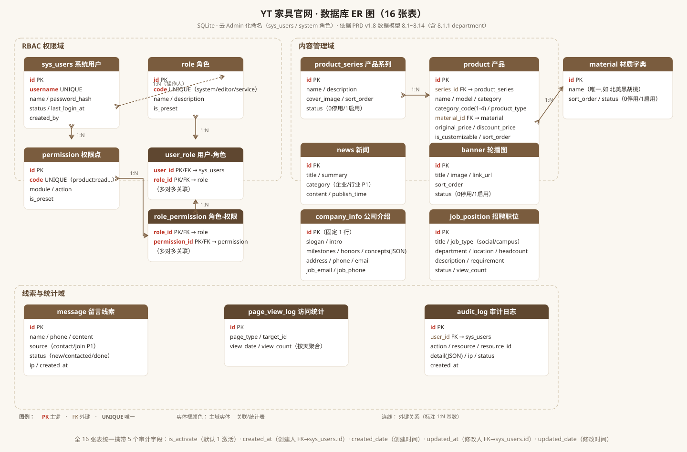
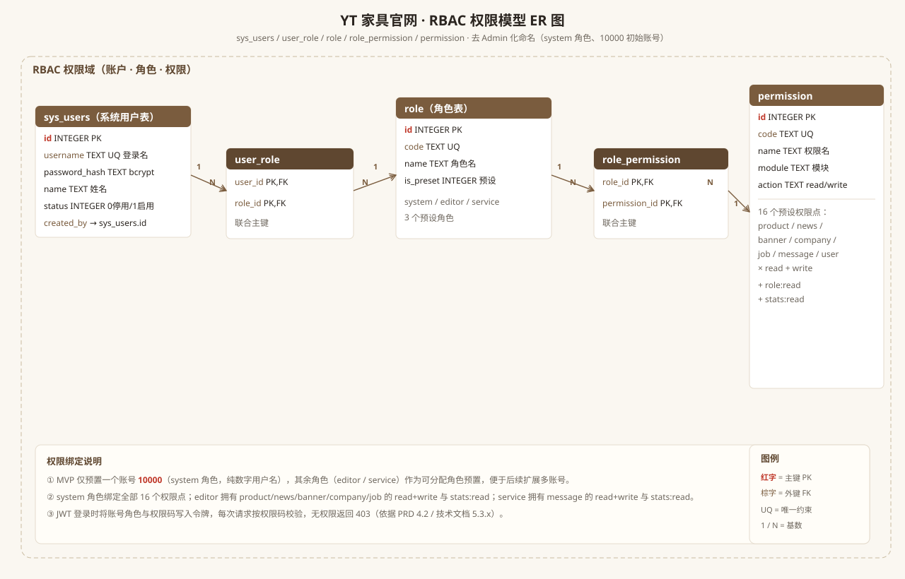

# 数据库设计文档 · YT 品牌家具官网

| 项目 | 内容 |
| --- | --- |
| 文档版本 | v1.3（同步后台 v2.2：banner 补投放字段 / audit_log 补 export / 权限点补 audit:read / sys_users 保持） |
| 创建日期 | 2026-08-25 |
| 依据文档 | `PRD-YT品牌家具官网.md` v1.9、`开发技术文档-YT家具官网.md` v1.7 |
| 适用范围 | 后台管理系统（Backend / `backend/`）+ 后端服务（Api / `api/`） |
| 数据库 | SQLite（开发）；生产可迁移 PostgreSQL / MySQL（迁移说明见 5.4） |

> **全局约束（来自 PRD 设计原则 DP-1 / DP-2）**
> - **DP-1**：后台是给公司内部人员使用的，不是专门给管理员用的。文档与代码中不使用 `Admin` / `管理员` 命名字段、模块或路径。
> - **DP-2**：`sys_users` 是用户表，不代表仅供管理员使用。它存储所有内部人员账号（system / editor / service 角色）。

---

## 1. 文档概述

### 1.1 目的与范围
本文档定义 YT 品牌家具官网的数据库结构，覆盖账户与权限（RBAC + 部门）、产品、内容（新闻 / 轮播图 / 公司介绍）、招聘、互动（留言）、运营与审计（访问统计 / 审计日志）六大业务域，共 **16 张表**（含新增材质字典表 `material`）。文档给出 ER 图、数据字典（字段级）、建表 SQL 与种子数据，作为后端（FastAPI + SQLAlchemy）建模与初始化的唯一依据。

### 1.2 依据文档
- `PRD-YT品牌家具官网.md` v1.6：用户体系（4.2）、RBAC 三角色、数据模型（8.1~8.14）。
- `开发技术文档-YT家具官网.md` v1.4：第 5 章数据库设计（5.1 约定、5.3.1~5.3.14 表结构、5.4 索引、5.5 预置、5.6 ORM 模型）。

### 1.3 设计原则
- **DP-1 后台内部人员使用**：角色含 `system` / `editor` / `service`，不限于管理员。
- **DP-2 `sys_users` 是用户表**：存储全部内部人员账号，与 C 端访客无关。

### 1.4 术语与约定
| 术语 | 含义 |
| --- | --- |
| 后台 / Backend | `backend/`，浏览器访问的管理系统，给公司内部人员用 |
| 后端 / Api | `api/`，Python FastAPI 对外服务 |
| 前台 / Frontend | `frontend/`，C 端展示官网 |
| sys_users | 系统内部用户表（非 admin_user） |
| system 角色 | 系统管理员角色（非 admin 角色） |
| 10000 | 初始系统管理员账号（纯数字，旧称 sysadmin） |

---

## 2. 总体设计约定

### 2.1 数据库选型
- 开发环境使用 **SQLite**（`yt_furniture.db`），零运维、便于本地联调。
- 生产环境建议迁移至 **PostgreSQL / MySQL**；表结构以 SQLite 为准，迁移时注意类型映射（`TEXT` 日期时间 → `TIMESTAMP`、`TEXT` → `VARCHAR/TEXT`、`INTEGER` → `INT/BIGINT`）。
- 启用外键约束：SQLite 连接后需执行 `PRAGMA foreign_keys = ON;`（详见 5.4）。

### 2.2 命名规范
- 表名、字段名一律 **snake_case** 小写：`sys_users`、`created_at`、`series_id`。
- 主键统一为 `id`（自增整数）。
- 外键命名 `<关联表单数>_id`，如 `series_id` → `product_series.id`、`user_id` → `sys_users.id`。
- 关联表以两表名组合：`user_role`、`role_permission`，联合主键。
- 时间字段统一 `TEXT`（UTC，ISO 8601 字符串 `YYYY-MM-DD HH:MM:SS`；SQLite 无原生日期时间类型，时间统一以 TEXT 存储）。
- **去 Admin 化**：禁止 `admin_user` / `admin` 角色 / `admin.*` 等命名；统一使用 `sys_users` / `system` 角色 / `sys.*`。

### 2.3 通用字段约定
| 字段 | 类型 | 说明 |
| --- | --- | --- |
| id | INTEGER | 主键，自增 |
| created_date | TEXT | 创建时间（时间戳，ISO 8601，默认 CURRENT_TIMESTAMP） |
| updated_date | TEXT | 更新时间（时间戳，ISO 8601，更新时刷新） |
| created_at | INTEGER | 创建人 `sys_users.id`（操作账号 ID，预置 10000 为 NULL） |
| updated_at | INTEGER | 修改人 `sys_users.id`（操作账号 ID） |
| is_activate | INTEGER | 1 激活 / 0 禁用，默认 1 |
| status | INTEGER | 0 停用 / 1 启用（或 0 下架/已关闭 / 1 上架/招聘中，按表语义） |

### 2.4 字符集与类型
- 字符集 `utf8mb4`（SQLite 默认 UTF-8，已含中文与 emoji）。
- 富文本（描述 / 正文）存 `TEXT`，内容为受信任的 HTML（后台富文本编辑器产出，须做 XSS 清洗）。
- 扩展结构（参数、图片列表、JSON 配置）存 `TEXT`，内容为 JSON 字符串。
- **SQLite 原生类型**：SQLite 仅内置 5 种存储类（`NULL` / `INTEGER` / `REAL` / `TEXT` / `BLOB`）。本文档数据字典与建表 DDL 全部使用 SQLite 原生声明类型——`INTEGER`（整型 / 自增主键）、`TEXT`（字符串 / 富文本 / JSON / 日期时间）、`REAL`（浮点）；不使用 `DATETIME` / `DATE` / `VARCHAR` / `TIMESTAMP` 等非 SQLite 声明，避免 NUMERIC 亲和度歧义。

---

## 3. ER 图

### 3.1 整体 ER 图（16 张表）
下图展示全部 16 张表及其跨域关系，按业务域分组（账户与权限 / 产品 / 内容 / 招聘 / 互动 / 运营审计）。



> 图源：`docs/images/er-diagram.svg`（与技术文档共用，已含 16 表完整关系与 crow's-foot 基数标记；产品表已含 6 个新增字段、新增材质字典表 `material`）。

### 3.2 RBAC 权限 ER 图
权限域五表（`sys_users` / `user_role` / `role` / `role_permission` / `permission`）的详细关系与权限绑定规则：



> 图源：`docs/images/db-er-rbac.svg`（本文档新增，展示三角色、16 权限点、初始账号 10000 绑定关系）。

---

## 4. 数据字典（16 张表）

### 4.1 账户与权限域

#### 4.1.1 系统用户表 `sys_users`
存储所有内部人员账号（system / editor / service 角色）。

| 字段 | 类型 | 约束 | 说明 |
| --- | --- | --- | --- |
| id | INTEGER | PK | 主键 |
| username | TEXT | UNIQUE NOT NULL CHECK (username GLOB '[0-9]*') | 用户名（**纯数字**，登录用，不可改） |
| name | TEXT | NOT NULL | 姓名 |
| nickname | TEXT | NULL | 昵称 |
| password_hash | TEXT | NOT NULL | bcrypt 哈希 |
| phone | TEXT | UNIQUE CHECK (length(phone) = 11) | 手机号（11 位） |
| id_card | TEXT | UNIQUE CHECK (length(id_card) IN (15, 18)) | 身份证号（15 / 18 位） |
| address | TEXT | NULL | 联系地址 |
| gender | INTEGER | DEFAULT 0 | 0 未知 / 1 男 / 2 女 |
| department_id | INTEGER | NULL（FK → department.id） | 所属部门（部门删除后置 NULL） |
| status | INTEGER | DEFAULT 1 | 0 停用 / 1 启用 |
| last_login_at | TEXT | NULL | 最后登录时间 |
| last_login_ip | TEXT | NULL | 最后登录 IP |
| created_at | INTEGER | NULL（FK → sys_users.id） | 创建人（操作账号 ID，自引用，预置 10000 为 NULL） |
| created_date / updated_date | TEXT | NOT NULL | 创建/修改时间（时间戳） |
| updated_at | INTEGER | NULL（FK → sys_users.id） | 修改人（操作账号 ID，自引用） |
| is_activate | INTEGER | NOT NULL DEFAULT 1 | 1 激活 / 0 禁用 |

- 外键：
  - `department_id` → `department.id`（ON DELETE SET NULL，部门删除后用户保留，部门字段置空）
  - `created_at` → `sys_users.id`（自引用，预置数据为空）

#### 4.1.2 角色表 `role`
| 字段 | 类型 | 约束 | 说明 |
| --- | --- | --- | --- |
| id | INTEGER | PK | 主键 |
| code | TEXT | UNIQUE NOT NULL | 角色编码：system / editor / service |
| name | TEXT | NOT NULL | 角色名称 |
| description | TEXT | NULL | 角色说明 |
| is_preset | INTEGER | DEFAULT 1 | 1 预设（不可删除） |
| created_date / updated_date | TEXT | NOT NULL | 创建/修改时间（时间戳） |
| created_at | INTEGER | NULL（FK → sys_users.id） | 创建人（操作账号 ID） |
| updated_at | INTEGER | NULL（FK → sys_users.id） | 修改人（操作账号 ID） |
| is_activate | INTEGER | NOT NULL DEFAULT 1 | 1 激活 / 0 禁用 |

- 种子数据：`system`（系统管理员）、`editor`（内容编辑）、`service`（客服）

#### 4.1.3 权限点表 `permission`
| 字段 | 类型 | 约束 | 说明 |
| --- | --- | --- | --- |
| id | INTEGER | PK | 主键 |
| code | TEXT | UNIQUE NOT NULL | 如 `product:read` |
| name | TEXT | NOT NULL | 权限名称 |
| module | TEXT | NOT NULL | product / news / banner / company / job / message / user / role / stats / audit |
| action | TEXT | NOT NULL | read / write |
| is_preset | INTEGER | DEFAULT 1 | 1 预设 |
| created_date / updated_date | TEXT | NOT NULL DEFAULT CURRENT_TIMESTAMP | 创建/修改时间（时间戳） |
| created_at | INTEGER | NULL（FK → sys_users.id） | 创建人（操作账号 ID） |
| updated_at | INTEGER | NULL（FK → sys_users.id） | 修改人（操作账号 ID） |
| is_activate | INTEGER | NOT NULL DEFAULT 1 | 1 激活 / 0 禁用 |

- 种子数据：**17 个权限点**（`product / news / banner / company / job / message / user` 各 read+write，`role:read`、`stats:read`、`audit:read`）。详见附录 6.1。

#### 4.1.4 用户-角色关联表 `user_role`
| 字段 | 类型 | 约束 |
| --- | --- | --- |
| user_id | INTEGER | FK → sys_users.id，联合主键 |
| role_id | INTEGER | FK → role.id，联合主键 |
| created_date / updated_date | TEXT | NOT NULL DEFAULT CURRENT_TIMESTAMP |
| created_at | INTEGER | NULL（FK → sys_users.id） |
| updated_at | INTEGER | NULL（FK → sys_users.id） |
| is_activate | INTEGER | NOT NULL DEFAULT 1 |

- 索引：`idx_user_role_uid`（user_id）
- 删除策略：`ON DELETE CASCADE`

#### 4.1.5 角色-权限关联表 `role_permission`
| 字段 | 类型 | 约束 |
| --- | --- | --- |
| role_id | INTEGER | FK → role.id，联合主键 |
| permission_id | INTEGER | FK → permission.id，联合主键 |
| created_date / updated_date | TEXT | NOT NULL DEFAULT CURRENT_TIMESTAMP |
| created_at | INTEGER | NULL（FK → sys_users.id） |
| updated_at | INTEGER | NULL（FK → sys_users.id） |
| is_activate | INTEGER | NOT NULL DEFAULT 1 |

- 索引：`idx_role_perm_rid`（role_id）
- 删除策略：`ON DELETE CASCADE`

**默认权限矩阵（种子数据）**

| 权限 \ 角色 | system | editor | service |
| --- | --- | --- | --- |
| product / news / banner / company / job (read+write) | ✓ | ✓ | — |
| message (read+write) | ✓ | — | ✓ |
| user (read+write) | ✓ | — | — |
| role:read | ✓ | — | — |
| stats:read | ✓ | ✓ | ✓ |
| audit:read | ✓ | — | — |

#### 4.1.6 部门表 `department`
内部组织架构的基础表（行政部 / 市场部 / 销售部 / 生产部等），用于 `sys_users.department_id` 关联。

| 字段 | 类型 | 约束 | 说明 |
| --- | --- | --- | --- |
| id | INTEGER | PK | 主键 |
| name | TEXT | UNIQUE NOT NULL | 部门名称 |
| sort_order | INTEGER | DEFAULT 0 | 排序（升序） |
| created_date / updated_date | TEXT | NOT NULL | 创建/修改时间（时间戳） |
| created_at | INTEGER | NULL（FK → sys_users.id） | 创建人（操作账号 ID） |
| updated_at | INTEGER | NULL（FK → sys_users.id） | 修改人（操作账号 ID） |
| is_activate | INTEGER | NOT NULL DEFAULT 1 | 1 激活 / 0 禁用 |

- 外键关联：被 `sys_users.department_id` 引用（1:N）
- 种子数据：行政部、市场部、销售部、生产部

### 4.2 产品域

#### 4.2.1 产品系列表 `product_series`
| 字段 | 类型 | 约束 | 说明 |
| --- | --- | --- | --- |
| id | INTEGER | PK | 主键 |
| name | TEXT | NOT NULL | 系列名称（如：云栖、简序） |
| description | TEXT | NULL | 系列简介 |
| cover_image | TEXT | NULL | 封面图 URL |
| sort_order | INTEGER | DEFAULT 0 | 排序（升序） |
| status | INTEGER | DEFAULT 1 | 0 停用 / 1 启用 |
| created_date / updated_date | TEXT | NOT NULL | 创建/修改时间（时间戳） |
| created_at | INTEGER | NULL（FK → sys_users.id） | 创建人（操作账号 ID） |
| updated_at | INTEGER | NULL（FK → sys_users.id） | 修改人（操作账号 ID） |
| is_activate | INTEGER | NOT NULL DEFAULT 1 | 1 激活 / 0 禁用 |

- 外键关联：被 `product.series_id` 引用（1:N）

#### 4.2.2 产品表 `product`
| 字段 | 类型 | 约束 | 说明 |
| --- | --- | --- | --- |
| id | INTEGER | PK | 主键 |
| series_id | INTEGER | FK → product_series.id | 所属系列 |
| name | TEXT | NOT NULL | 产品名称 |
| model | TEXT | NULL | 型号（如 YQ-SF-3108） |
| category | TEXT | NOT NULL | 分类名称：民用 / 办公 / 软体 / 定制 |
| category_code | INTEGER | NOT NULL DEFAULT 1 CHECK (category_code IN (1,2,3,4)) | 分类编号：1 民用 / 2 办公 / 3 软体 / 4 定制 |
| material_id | INTEGER | NULL，FK → material.id | 材质（关联材质字典 `material`） |
| product_type | TEXT | NOT NULL CHECK (product_type IN ('床','沙发','桌椅','柜体','衣柜','茶几','床垫','其他')) | 产品类型（枚举，可扩展） |
| description | TEXT | NULL | 图文描述（富文本 HTML） |
| params | TEXT | NULL | JSON 键值对（尺寸 / 颜色等；材质独立为 `material` 表） |
| original_price | REAL | NULL | 原价（元） |
| discount_price | REAL | NULL | 折扣价（元；为空表示无折扣，按 `original_price` 展示） |
| cover_image | TEXT | NULL | 主图 URL |
| images | TEXT | NULL | JSON 数组（详情图 URL 列表） |
| is_customizable | INTEGER | NOT NULL DEFAULT 0 | 是否定制：0 否 / 1 是 |
| sort_order | INTEGER | DEFAULT 0 | 排序 |
| status | INTEGER | DEFAULT 1 | 0 下架 / 1 上架 |
| view_count | INTEGER | DEFAULT 0 | 浏览量 |
| created_date / updated_date | TEXT | NOT NULL | 创建/修改时间（时间戳） |
| created_at | INTEGER | NULL（FK → sys_users.id） | 创建人（操作账号 ID） |
| updated_at | INTEGER | NULL（FK → sys_users.id） | 修改人（操作账号 ID） |
| is_activate | INTEGER | NOT NULL DEFAULT 1 | 1 激活 / 0 禁用 |

- 索引：`idx_product_series`（series_id）、`idx_product_status`（status, sort_order）、`idx_product_cat`（category）、`idx_product_material`（material_id）
- 外键：`series_id` → `product_series.id`（删除策略：RESTRICT，避免误删有产品的系列）；`material_id` → `material.id`（删除策略：ON DELETE SET NULL，材质删除后产品保留、材质字段置空）
- 价格说明：`original_price` 为吊牌 / 原价；`discount_price` 为空时按 `original_price` 展示。金额字段用 `REAL`（SQLite 浮点）；若后续需精确分账可改为 `TEXT` 存「分」整数。

#### 4.2.3 材质字典表 `material`
产品材质的字典表，供 `product.material_id` 关联引用（独立成表便于统一维护与筛选）。

| 字段 | 类型 | 约束 | 说明 |
| --- | --- | --- | --- |
| id | INTEGER | PK | 主键 |
| code | TEXT | UNIQUE NOT NULL | 材质编号（如 wood / fabric / leather / metal） |
| name | TEXT | NOT NULL | 材质名称（如实木 / 布艺 / 真皮 / 金属） |
| sort_order | INTEGER | DEFAULT 0 | 排序（升序） |
| status | INTEGER | DEFAULT 1 | 0 停用 / 1 启用 |
| created_date / updated_date | TEXT | NOT NULL | 创建/修改时间（时间戳） |
| created_at | INTEGER | NULL（FK → sys_users.id） | 创建人（操作账号 ID） |
| updated_at | INTEGER | NULL（FK → sys_users.id） | 修改人（操作账号 ID） |
| is_activate | INTEGER | NOT NULL DEFAULT 1 | 1 激活 / 0 禁用 |

- 外键关联：被 `product.material_id` 引用（1:N，删除策略 ON DELETE SET NULL）
- 种子数据：实木、布艺、真皮、金属、岩板、玻璃（可选，便于联调）

### 4.3 内容域

#### 4.3.1 新闻表 `news`
| 字段 | 类型 | 约束 | 说明 |
| --- | --- | --- | --- |
| id | INTEGER | PK | 主键 |
| title | TEXT | NOT NULL | 标题 |
| summary | TEXT | NULL | 摘要 |
| category | TEXT | DEFAULT 'enterprise' | P1：enterprise（企业新闻）/ industry（行业资讯） |
| cover_image | TEXT | NULL | 封面图 URL |
| content | TEXT | NOT NULL | 正文（富文本 HTML） |
| publish_time | TEXT | NOT NULL | 发布时间 |
| view_count | INTEGER | DEFAULT 0 | 浏览量 |
| created_date / updated_date | TEXT | NOT NULL | 创建/修改时间（时间戳） |
| created_at | INTEGER | NULL（FK → sys_users.id） | 创建人（操作账号 ID） |
| updated_at | INTEGER | NULL（FK → sys_users.id） | 修改人（操作账号 ID） |
| is_activate | INTEGER | NOT NULL DEFAULT 1 | 1 激活 / 0 禁用 |

- 索引：`idx_news_publish`（publish_time DESC）、`idx_news_category`（category）

#### 4.3.2 轮播图表 `banner`
| 字段 | 类型 | 约束 | 说明 |
| --- | --- | --- | --- |
| id | INTEGER | PK | 主键 |
| group_code | TEXT | DEFAULT 'home' | 分组编码：home / category / mobile / popup / float |
| title | TEXT | NULL | 标题 |
| subtitle | TEXT | NULL | 副标题 |
| image | TEXT | NOT NULL | 图片 URL（PC 端） |
| image_mobile | TEXT | NULL | 移动端图片 URL |
| link_type | TEXT | DEFAULT 'internal' | 链接类型：internal / external |
| link_target | TEXT | NULL | 链接目标（内部路由或外部 URL） |
| button_text | TEXT | NULL | 按钮文字 |
| button_color | TEXT | NULL | 按钮颜色（色值） |
| platforms | TEXT | NULL | JSON 数组：["web","app","wechat"] |
| start_date | TEXT | NULL | 上线时间（ISO 8601） |
| end_date | TEXT | NULL | 下线时间（ISO 8601） |
| sort_order | INTEGER | DEFAULT 0 | 组内排序 |
| status | INTEGER | DEFAULT 1 | 0 停用 / 1 启用 |
| impressions | INTEGER | DEFAULT 0 | 累计曝光 PV |
| clicks | INTEGER | DEFAULT 0 | 累计点击 |
| created_date / updated_date | TEXT | NOT NULL | 创建/修改时间（时间戳） |
| created_at | INTEGER | NULL（FK → sys_users.id） | 创建人（操作账号 ID） |
| updated_at | INTEGER | NULL（FK → sys_users.id） | 修改人（操作账号 ID） |
| is_activate | INTEGER | NOT NULL DEFAULT 1 | 1 激活 / 0 禁用 |

- 说明：仅 `status=1` 且当前时间在 `start_date ~ end_date` 内（无上下线时间视为长期）的轮播图在前台展示，按 `group_code` + `sort_order` 升序；`ctr` = clicks / impressions 实时计算不落库。

#### 4.3.3 公司介绍单行配置表 `company_info`
| 字段 | 类型 | 约束 | 说明 |
| --- | --- | --- | --- |
| id | INTEGER | PK DEFAULT 1 | 固定 1 行 |
| slogan | TEXT | NULL | 品牌 Slogan |
| intro | TEXT | NULL | 企业简介（富文本） |
| milestones | TEXT | NULL | JSON：[{year, event}] |
| honors | TEXT | NULL | JSON：[{title, image}] |
| concepts | TEXT | NULL | JSON：[{title, description, icon}] |
| address / phone / email / business_hours | TEXT | NULL | 联系信息 |
| job_email / job_phone | TEXT | NULL | 招聘投递邮箱 / 电话（职位详情页展示） |
| created_date | TEXT | NOT NULL DEFAULT CURRENT_TIMESTAMP | 创建时间 |
| updated_date | TEXT | NOT NULL | 更新时间 |
| created_at | INTEGER | NULL（FK → sys_users.id） | 创建人（操作账号 ID） |
| updated_at | INTEGER | NULL（FK → sys_users.id） | 修改人（操作账号 ID） |
| is_activate | INTEGER | NOT NULL DEFAULT 1 | 1 激活 / 0 禁用 |

- 说明：单行配置表，全站共用；`job_email` / `job_phone` 作为 `job_position` 投递方式的缺省值。

### 4.4 招聘域

#### 4.4.1 招聘职位表 `job_position`
| 字段 | 类型 | 约束 | 说明 |
| --- | --- | --- | --- |
| id | INTEGER | PK | 主键 |
| title | TEXT | NOT NULL | 职位名称 |
| job_type | TEXT | NOT NULL | social（社会招聘）/ campus（校园招聘） |
| department | TEXT | NULL | 部门 |
| location | TEXT | NOT NULL | 工作地点 |
| headcount | INTEGER | NULL | 招聘人数（可空） |
| description | TEXT | NULL | 职位描述 / 职责（富文本 HTML） |
| requirement | TEXT | NULL | 任职要求（富文本 HTML） |
| contact_email | TEXT | NULL | 投递邮箱（缺省用 company_info） |
| contact_phone | TEXT | NULL | 投递电话（缺省用 company_info） |
| publish_time | TEXT | NOT NULL | 发布时间 |
| status | INTEGER | DEFAULT 1 | 0 已关闭 / 1 招聘中 |
| view_count | INTEGER | DEFAULT 0 | 浏览量 |
| created_date / updated_date | TEXT | NOT NULL | 创建/修改时间（时间戳） |
| created_at | INTEGER | NULL（FK → sys_users.id） | 创建人（操作账号 ID） |
| updated_at | INTEGER | NULL（FK → sys_users.id） | 修改人（操作账号 ID） |
| is_activate | INTEGER | NOT NULL DEFAULT 1 | 1 激活 / 0 禁用 |

- 索引：`idx_job_type_status`（job_type, status）

### 4.5 互动域

#### 4.5.1 留言线索表 `message`
| 字段 | 类型 | 约束 | 说明 |
| --- | --- | --- | --- |
| id | INTEGER | PK | 主键 |
| name | TEXT | NOT NULL | 姓名 |
| phone | TEXT | NOT NULL | 联系电话 |
| content | TEXT | NOT NULL | 留言内容 |
| source | TEXT | DEFAULT 'contact' | contact（普通）/ join（加盟 P1） |
| status | TEXT | DEFAULT 'new' | new / contacted / done |
| ip | TEXT | NULL | 提交 IP（取 X-Forwarded-For 首段） |
| created_date | TEXT | NOT NULL | 提交时间 |
| created_at | INTEGER | NULL（FK → sys_users.id） | 创建人（操作账号 ID） |
| updated_date | TEXT | NOT NULL DEFAULT CURRENT_TIMESTAMP | 修改时间 |
| updated_at | INTEGER | NULL（FK → sys_users.id） | 修改人（操作账号 ID） |
| is_activate | INTEGER | NOT NULL DEFAULT 1 | 1 激活 / 0 禁用 |

- 索引：`idx_msg_status`（status, created_date DESC）

### 4.6 运营与审计域

#### 4.6.1 访问统计表 `page_view_log`（按天聚合）
| 字段 | 类型 | 约束 | 说明 |
| --- | --- | --- | --- |
| id | INTEGER | PK | 主键 |
| page_type | TEXT | NOT NULL | home / product / news / other |
| target_id | INTEGER | NULL | 产品 / 新闻 ID |
| view_date | TEXT | NOT NULL | 访问日期（YYYY-MM-DD） |
| view_count | INTEGER | DEFAULT 0 | 当日计数 |
| UNIQUE | (page_type, target_id, view_date) | 唯一 | 聚合键 |
| created_date / updated_date | TEXT | NOT NULL DEFAULT CURRENT_TIMESTAMP | 创建/修改时间（时间戳） |
| created_at | INTEGER | NULL（FK → sys_users.id） | 创建人（操作账号 ID） |
| updated_at | INTEGER | NULL（FK → sys_users.id） | 修改人（操作账号 ID） |
| is_activate | INTEGER | NOT NULL DEFAULT 1 | 1 激活 / 0 禁用 |

- 索引：`idx_pv_agg`（page_type, view_date）
- 说明：按天聚合展示量，避免逐条记录；`target_id` 关联 `product.id` 或 `news.id`（依据 page_type 语义，不强制外键）。

#### 4.6.2 审计日志表 `audit_log`
| 字段 | 类型 | 约束 | 说明 |
| --- | --- | --- | --- |
| id | INTEGER | PK | 主键 |
| user_id | INTEGER | FK → sys_users.id | 操作人 |
| username | TEXT | NOT NULL | 操作人用户名（冗余） |
| action | TEXT | NOT NULL | login / logout / create / update / delete / status_change / upload / password_reset / export / permission_change |
| resource | TEXT | NOT NULL | product / news / banner / company / job / message / user / role / auth / audit |
| resource_id | INTEGER | NULL | 资源 ID |
| detail | TEXT | NULL | JSON 变更详情 |
| ip | TEXT | NULL | 操作 IP |
| user_agent | TEXT | NULL | UA |
| status | INTEGER | DEFAULT 1 | 1 成功 / 0 失败 |
| created_date | TEXT | NOT NULL | 操作时间 |
| created_at | INTEGER | NULL（FK → sys_users.id） | 创建人（操作账号 ID） |
| updated_date | TEXT | NOT NULL DEFAULT CURRENT_TIMESTAMP | 修改时间 |
| updated_at | INTEGER | NULL（FK → sys_users.id） | 修改人（操作账号 ID） |
| is_activate | INTEGER | NOT NULL DEFAULT 1 | 1 激活 / 0 禁用 |

- 索引：`idx_audit_created`（created_date DESC）
- 外键：`user_id` → `sys_users.id`（删除策略：SET NULL，保留审计记录）

---

## 5. 建表 SQL

### 5.1 建表语句（SQLite）

```sql
PRAGMA foreign_keys = ON;

-- ===================== 账户与权限域 =====================
-- 部门表（基础表，必须先于 sys_users 创建，因为 sys_users.department_id 引用之）
CREATE TABLE department (
    id         INTEGER PRIMARY KEY AUTOINCREMENT,
    name       TEXT    NOT NULL UNIQUE,
    sort_order INTEGER NOT NULL DEFAULT 0,
    created_date TEXT     NOT NULL DEFAULT CURRENT_TIMESTAMP,
    updated_date TEXT     NOT NULL DEFAULT CURRENT_TIMESTAMP,
    created_at   INTEGER REFERENCES sys_users(id) ON DELETE SET NULL,
    updated_at   INTEGER REFERENCES sys_users(id) ON DELETE SET NULL,
    is_activate  INTEGER NOT NULL DEFAULT 1
);

CREATE TABLE sys_users (
    id            INTEGER PRIMARY KEY AUTOINCREMENT,
    username      TEXT    NOT NULL UNIQUE CHECK (username GLOB '[0-9]*'),
    name          TEXT    NOT NULL,
    nickname      TEXT,
    password_hash TEXT    NOT NULL,
    phone         TEXT    UNIQUE CHECK (length(phone) = 11),
    id_card       TEXT    UNIQUE CHECK (length(id_card) IN (15, 18)),
    address       TEXT,
    gender        INTEGER NOT NULL DEFAULT 0,
    department_id INTEGER REFERENCES department(id) ON DELETE SET NULL,
    status        INTEGER NOT NULL DEFAULT 1,
    last_login_at TEXT    ,
    last_login_ip TEXT,
    created_at    INTEGER REFERENCES sys_users(id) ON DELETE SET NULL,
    created_date    TEXT     NOT NULL DEFAULT CURRENT_TIMESTAMP,
    updated_date    TEXT     NOT NULL DEFAULT CURRENT_TIMESTAMP,
    updated_at   INTEGER REFERENCES sys_users(id) ON DELETE SET NULL,
    is_activate  INTEGER NOT NULL DEFAULT 1
);

CREATE TABLE role (
    id          INTEGER PRIMARY KEY AUTOINCREMENT,
    code        TEXT    NOT NULL UNIQUE,
    name        TEXT    NOT NULL,
    description TEXT,
    is_preset   INTEGER NOT NULL DEFAULT 1,
    created_date  TEXT     NOT NULL DEFAULT CURRENT_TIMESTAMP,
    updated_date  TEXT     NOT NULL DEFAULT CURRENT_TIMESTAMP,
    created_at   INTEGER REFERENCES sys_users(id) ON DELETE SET NULL,
    updated_at   INTEGER REFERENCES sys_users(id) ON DELETE SET NULL,
    is_activate  INTEGER NOT NULL DEFAULT 1
);

CREATE TABLE permission (
    id        INTEGER PRIMARY KEY AUTOINCREMENT,
    code      TEXT    NOT NULL UNIQUE,
    name      TEXT    NOT NULL,
    module    TEXT    NOT NULL,
    action    TEXT    NOT NULL,
    is_preset INTEGER NOT NULL DEFAULT 1,
    created_date TEXT     NOT NULL DEFAULT CURRENT_TIMESTAMP,
    updated_date TEXT     NOT NULL DEFAULT CURRENT_TIMESTAMP,
    created_at   INTEGER REFERENCES sys_users(id) ON DELETE SET NULL,
    updated_at   INTEGER REFERENCES sys_users(id) ON DELETE SET NULL,
    is_activate  INTEGER NOT NULL DEFAULT 1
);

CREATE TABLE user_role (
    user_id INTEGER NOT NULL REFERENCES sys_users(id) ON DELETE CASCADE,
    role_id INTEGER NOT NULL REFERENCES role(id) ON DELETE CASCADE,
    created_date TEXT     NOT NULL DEFAULT CURRENT_TIMESTAMP,
    updated_date TEXT     NOT NULL DEFAULT CURRENT_TIMESTAMP,
    created_at   INTEGER REFERENCES sys_users(id) ON DELETE SET NULL,
    updated_at   INTEGER REFERENCES sys_users(id) ON DELETE SET NULL,
    is_activate  INTEGER NOT NULL DEFAULT 1,
    PRIMARY KEY (user_id, role_id)
);

CREATE TABLE role_permission (
    role_id       INTEGER NOT NULL REFERENCES role(id) ON DELETE CASCADE,
    permission_id INTEGER NOT NULL REFERENCES permission(id) ON DELETE CASCADE,
    created_date TEXT     NOT NULL DEFAULT CURRENT_TIMESTAMP,
    updated_date TEXT     NOT NULL DEFAULT CURRENT_TIMESTAMP,
    created_at   INTEGER REFERENCES sys_users(id) ON DELETE SET NULL,
    updated_at   INTEGER REFERENCES sys_users(id) ON DELETE SET NULL,
    is_activate  INTEGER NOT NULL DEFAULT 1,
    PRIMARY KEY (role_id, permission_id)
);

-- ===================== 产品域 =====================
CREATE TABLE product_series (
    id           INTEGER PRIMARY KEY AUTOINCREMENT,
    name         TEXT    NOT NULL,
    description  TEXT,
    cover_image  TEXT,
    sort_order   INTEGER NOT NULL DEFAULT 0,
    status       INTEGER NOT NULL DEFAULT 1,
    created_date   TEXT     NOT NULL DEFAULT CURRENT_TIMESTAMP,
    updated_date   TEXT     NOT NULL DEFAULT CURRENT_TIMESTAMP,
    created_at   INTEGER REFERENCES sys_users(id) ON DELETE SET NULL,
    updated_at   INTEGER REFERENCES sys_users(id) ON DELETE SET NULL,
    is_activate  INTEGER NOT NULL DEFAULT 1
);

CREATE TABLE material (
    id           INTEGER PRIMARY KEY AUTOINCREMENT,
    code         TEXT    NOT NULL UNIQUE,
    name         TEXT    NOT NULL,
    sort_order   INTEGER NOT NULL DEFAULT 0,
    status       INTEGER NOT NULL DEFAULT 1,
    created_date   TEXT     NOT NULL DEFAULT CURRENT_TIMESTAMP,
    updated_date   TEXT     NOT NULL DEFAULT CURRENT_TIMESTAMP,
    created_at   INTEGER REFERENCES sys_users(id) ON DELETE SET NULL,
    updated_at   INTEGER REFERENCES sys_users(id) ON DELETE SET NULL,
    is_activate  INTEGER NOT NULL DEFAULT 1
);

CREATE TABLE product (
    id           INTEGER PRIMARY KEY AUTOINCREMENT,
    series_id    INTEGER REFERENCES product_series(id) ON DELETE RESTRICT,
    name         TEXT    NOT NULL,
    model        TEXT,
    category     TEXT    NOT NULL,
    category_code INTEGER NOT NULL DEFAULT 1 CHECK (category_code IN (1,2,3,4)),
    material_id  INTEGER REFERENCES material(id) ON DELETE SET NULL,
    product_type TEXT    NOT NULL CHECK (product_type IN ('床','沙发','桌椅','柜体','衣柜','茶几','床垫','其他')),
    description  TEXT,
    params       TEXT,
    original_price REAL,
    discount_price  REAL,
    cover_image  TEXT,
    images       TEXT,
    is_customizable INTEGER NOT NULL DEFAULT 0,
    sort_order   INTEGER NOT NULL DEFAULT 0,
    status       INTEGER NOT NULL DEFAULT 1,
    view_count   INTEGER NOT NULL DEFAULT 0,
    created_date   TEXT     NOT NULL DEFAULT CURRENT_TIMESTAMP,
    updated_date   TEXT     NOT NULL DEFAULT CURRENT_TIMESTAMP,
    created_at   INTEGER REFERENCES sys_users(id) ON DELETE SET NULL,
    updated_at   INTEGER REFERENCES sys_users(id) ON DELETE SET NULL,
    is_activate  INTEGER NOT NULL DEFAULT 1
);

-- ===================== 内容域 =====================
CREATE TABLE news (
    id           INTEGER PRIMARY KEY AUTOINCREMENT,
    title        TEXT    NOT NULL,
    summary      TEXT,
    category     TEXT    NOT NULL DEFAULT 'enterprise',
    cover_image  TEXT,
    content      TEXT    NOT NULL,
    publish_time TEXT     NOT NULL,
    view_count   INTEGER NOT NULL DEFAULT 0,
    created_date   TEXT     NOT NULL DEFAULT CURRENT_TIMESTAMP,
    updated_date   TEXT     NOT NULL DEFAULT CURRENT_TIMESTAMP,
    created_at   INTEGER REFERENCES sys_users(id) ON DELETE SET NULL,
    updated_at   INTEGER REFERENCES sys_users(id) ON DELETE SET NULL,
    is_activate  INTEGER NOT NULL DEFAULT 1
);

CREATE TABLE banner (
    id           INTEGER PRIMARY KEY AUTOINCREMENT,
    group_code   TEXT    NOT NULL DEFAULT 'home',
    title        TEXT,
    subtitle     TEXT,
    image        TEXT    NOT NULL,
    image_mobile TEXT,
    link_type    TEXT    NOT NULL DEFAULT 'internal',
    link_target  TEXT,
    button_text  TEXT,
    button_color TEXT,
    platforms    TEXT,
    start_date   TEXT,
    end_date     TEXT,
    sort_order   INTEGER NOT NULL DEFAULT 0,
    status       INTEGER NOT NULL DEFAULT 1,
    impressions  INTEGER NOT NULL DEFAULT 0,
    clicks       INTEGER NOT NULL DEFAULT 0,
    created_date   TEXT     NOT NULL DEFAULT CURRENT_TIMESTAMP,
    updated_date   TEXT     NOT NULL DEFAULT CURRENT_TIMESTAMP,
    created_at   INTEGER REFERENCES sys_users(id) ON DELETE SET NULL,
    updated_at   INTEGER REFERENCES sys_users(id) ON DELETE SET NULL,
    is_activate  INTEGER NOT NULL DEFAULT 1
);

CREATE TABLE company_info (
    id             INTEGER PRIMARY KEY CHECK (id = 1),
    slogan         TEXT,
    intro          TEXT,
    milestones      TEXT,
    honors          TEXT,
    concepts        TEXT,
    address         TEXT,
    phone           TEXT,
    email           TEXT,
    business_hours  TEXT,
    job_email       TEXT,
    job_phone       TEXT,
    updated_date      TEXT     NOT NULL DEFAULT CURRENT_TIMESTAMP,
    created_date TEXT     NOT NULL DEFAULT CURRENT_TIMESTAMP,
    created_at   INTEGER REFERENCES sys_users(id) ON DELETE SET NULL,
    updated_at   INTEGER REFERENCES sys_users(id) ON DELETE SET NULL,
    is_activate  INTEGER NOT NULL DEFAULT 1
);

-- ===================== 招聘域 =====================
CREATE TABLE job_position (
    id            INTEGER PRIMARY KEY AUTOINCREMENT,
    title         TEXT    NOT NULL,
    job_type      TEXT    NOT NULL,
    department    TEXT,
    location      TEXT    NOT NULL,
    headcount     INTEGER,
    description   TEXT,
    requirement   TEXT,
    contact_email TEXT,
    contact_phone TEXT,
    publish_time  TEXT     NOT NULL,
    status        INTEGER NOT NULL DEFAULT 1,
    view_count    INTEGER NOT NULL DEFAULT 0,
    created_date    TEXT     NOT NULL DEFAULT CURRENT_TIMESTAMP,
    updated_date    TEXT     NOT NULL DEFAULT CURRENT_TIMESTAMP,
    created_at   INTEGER REFERENCES sys_users(id) ON DELETE SET NULL,
    updated_at   INTEGER REFERENCES sys_users(id) ON DELETE SET NULL,
    is_activate  INTEGER NOT NULL DEFAULT 1
);

-- ===================== 互动域 =====================
CREATE TABLE message (
    id         INTEGER PRIMARY KEY AUTOINCREMENT,
    name       TEXT    NOT NULL,
    phone      TEXT    NOT NULL,
    content    TEXT    NOT NULL,
    source     TEXT    NOT NULL DEFAULT 'contact',
    status     TEXT    NOT NULL DEFAULT 'new',
    ip         TEXT,
    created_date TEXT     NOT NULL DEFAULT CURRENT_TIMESTAMP,
    updated_date TEXT     NOT NULL DEFAULT CURRENT_TIMESTAMP,
    created_at   INTEGER REFERENCES sys_users(id) ON DELETE SET NULL,
    updated_at   INTEGER REFERENCES sys_users(id) ON DELETE SET NULL,
    is_activate  INTEGER NOT NULL DEFAULT 1
);

-- ===================== 运营与审计域 =====================
CREATE TABLE page_view_log (
    id         INTEGER PRIMARY KEY AUTOINCREMENT,
    page_type  TEXT    NOT NULL,
    target_id  INTEGER,
    view_date  TEXT    NOT NULL,
    view_count INTEGER NOT NULL DEFAULT 0,
    created_date TEXT     NOT NULL DEFAULT CURRENT_TIMESTAMP,
    updated_date TEXT     NOT NULL DEFAULT CURRENT_TIMESTAMP,
    created_at   INTEGER REFERENCES sys_users(id) ON DELETE SET NULL,
    updated_at   INTEGER REFERENCES sys_users(id) ON DELETE SET NULL,
    is_activate  INTEGER NOT NULL DEFAULT 1,
    UNIQUE (page_type, target_id, view_date)
);

CREATE TABLE audit_log (
    id          INTEGER PRIMARY KEY AUTOINCREMENT,
    user_id     INTEGER REFERENCES sys_users(id) ON DELETE SET NULL,
    username    TEXT    NOT NULL,
    action      TEXT    NOT NULL,
    resource    TEXT    NOT NULL,
    resource_id INTEGER,
    detail      TEXT,
    ip          TEXT,
    user_agent  TEXT,
    status      INTEGER NOT NULL DEFAULT 1,
    created_date  TEXT     NOT NULL DEFAULT CURRENT_TIMESTAMP,
    updated_date TEXT     NOT NULL DEFAULT CURRENT_TIMESTAMP,
    created_at   INTEGER REFERENCES sys_users(id) ON DELETE SET NULL,
    updated_at   INTEGER REFERENCES sys_users(id) ON DELETE SET NULL,
    is_activate  INTEGER NOT NULL DEFAULT 1
);
```

### 5.2 索引

```sql
CREATE INDEX idx_product_series   ON product(series_id);
CREATE INDEX idx_product_status   ON product(status, sort_order);
CREATE INDEX idx_product_cat      ON product(category);
CREATE INDEX idx_product_material  ON product(material_id);
CREATE INDEX idx_news_publish     ON news(publish_time DESC);
CREATE INDEX idx_news_category    ON news(category);
CREATE INDEX idx_job_type_status  ON job_position(job_type, status);
CREATE INDEX idx_msg_status       ON message(status, created_date DESC);
CREATE INDEX idx_pv_agg           ON page_view_log(page_type, view_date);
CREATE INDEX idx_audit_created    ON audit_log(created_date DESC);
CREATE INDEX idx_user_role_uid    ON user_role(user_id);
CREATE INDEX idx_role_perm_rid    ON role_permission(role_id);
CREATE INDEX idx_sys_users_dept   ON sys_users(department_id);
```

### 5.3 种子数据

```sql
-- 0) 预置部门
INSERT INTO department (name, sort_order) VALUES
  ('行政部', 1),
  ('市场部', 2),
  ('销售部', 3),
  ('生产部', 4);

-- 0.5) 预置材质（字典表 material）
INSERT INTO material (code, name, sort_order, status) VALUES
  ('wood',    '实木', 1, 1),
  ('fabric',  '布艺', 2, 1),
  ('leather', '真皮', 3, 1),
  ('metal',   '金属', 4, 1),
  ('stone',   '岩板', 5, 1),
  ('glass',   '玻璃', 6, 1);

-- 1) 三角色
INSERT INTO role (code, name, description, is_preset) VALUES
  ('system',  '系统管理员', '拥有全部后台权限（含用户与角色管理）', 1),
  ('editor',  '内容编辑',   '负责产品/新闻/轮播图/公司介绍/招聘职位日常维护',   1),
  ('service', '客服',       '负责在线留言与加盟意向跟进',             1);

-- 2) 17 个权限点
INSERT INTO permission (code, name, module, action, is_preset) VALUES
  ('product:read',  '产品-查看', 'product', 'read',  1),
  ('product:write', '产品-编辑', 'product', 'write', 1),
  ('news:read',     '新闻-查看', 'news',    'read',  1),
  ('news:write',    '新闻-编辑', 'news',    'write', 1),
  ('banner:read',   '轮播图-查看', 'banner', 'read',  1),
  ('banner:write',  '轮播图-编辑', 'banner', 'write', 1),
  ('company:read',  '公司介绍-查看', 'company', 'read',  1),
  ('company:write', '公司介绍-编辑', 'company', 'write', 1),
  ('job:read',      '招聘-查看', 'job',    'read',  1),
  ('job:write',     '招聘-编辑', 'job',    'write', 1),
  ('message:read',  '留言-查看', 'message', 'read',  1),
  ('message:write', '留言-编辑', 'message', 'write', 1),
  ('user:read',     '用户-查看', 'user',    'read',  1),
  ('user:write',    '用户-编辑', 'user',    'write', 1),
  ('role:read',     '角色-查看', 'role',    'read',  1),
  ('stats:read',    '统计-查看', 'stats',   'read',  1),
  ('audit:read',    '操作日志-查看', 'audit', 'read',  1);

-- 3) 默认权限矩阵（role_permission）
-- system 角色：全部 17 个权限点
INSERT INTO role_permission (role_id, permission_id)
SELECT r.id, p.id FROM role r, permission p WHERE r.code = 'system';

-- editor 角色：product/news/banner/company/job 的 read+write + stats:read
INSERT INTO role_permission (role_id, permission_id)
SELECT r.id, p.id FROM role r, permission p
WHERE r.code = 'editor' AND p.module IN ('product','news','banner','company','job');
INSERT INTO role_permission (role_id, permission_id)
SELECT r.id, p.id FROM role r, permission p
WHERE r.code = 'editor' AND p.code = 'stats:read';

-- service 角色：message 的 read+write + stats:read
INSERT INTO role_permission (role_id, permission_id)
SELECT r.id, p.id FROM role r, permission p
WHERE r.code = 'service' AND p.module = 'message';
INSERT INTO role_permission (role_id, permission_id)
SELECT r.id, p.id FROM role r, permission p
WHERE r.code = 'service' AND p.code = 'stats:read';

-- 4) 初始系统管理员账号（username 必须为纯数字）
--    密码由环境变量 INIT_SYSADMIN_PASSWORD 注入（bcrypt 哈希），占位哈希，部署时由 scripts/init_db.py 替换；created_at 为 NULL
INSERT INTO sys_users (username, name, password_hash, status, created_at)
VALUES ('10000', '系统管理员', '<bcrypt-hash-from-INIT_SYSADMIN_PASSWORD>', 1, NULL);

-- 5) 绑定初始账号 → system 角色
INSERT INTO user_role (user_id, role_id)
SELECT u.id, r.id FROM sys_users u, role r
WHERE u.username = '10000' AND r.code = 'system';

-- 6) company_info 初始单行
INSERT INTO company_info (id, slogan) VALUES (1, 'YT 家具 · 让家更懂你');
```

### 5.4 初始化与迁移说明
- **初始化**：执行顺序为「建表（5.1）→ 建索引（5.2）→ 种子数据（5.3）」。脚本建议 `api/scripts/init_db.py`，使用 `Base.metadata.create_all` 建表后幂等写入种子数据。
- **密码注入**：初始账号 `10000` 密码通过环境变量 `INIT_SYSADMIN_PASSWORD` 注入，要求首次登录修改（`status=1` 仍可登录，登录后强制改密）。
- **外键**：SQLite 每次连接须 `PRAGMA foreign_keys = ON;`；SQLAlchemy 可在引擎事件钩子中设置。
- **生产迁移**：PostgreSQL / MySQL 迁移时，`TEXT`（ISO 8601 日期时间）→ `TIMESTAMP`、`created_at` 默认值改用 `NOW()`、`AUTOINCREMENT` → `SERIAL / AUTO_INCREMENT`；`company_info` 的 `CHECK (id=1)` 可保留或改为应用层约束。

---

## 6. 附录

### 6.1 权限码清单（17 项）
| 序号 | code | 名称 | module | action |
| --- | --- | --- | --- | --- |
| 1 | product:read | 产品-查看 | product | read |
| 2 | product:write | 产品-编辑 | product | write |
| 3 | news:read | 新闻-查看 | news | read |
| 4 | news:write | 新闻-编辑 | news | write |
| 5 | banner:read | 轮播图-查看 | banner | read |
| 6 | banner:write | 轮播图-编辑 | banner | write |
| 7 | company:read | 公司介绍-查看 | company | read |
| 8 | company:write | 公司介绍-编辑 | company | write |
| 9 | job:read | 招聘-查看 | job | read |
| 10 | job:write | 招聘-编辑 | job | write |
| 11 | message:read | 留言-查看 | message | read |
| 12 | message:write | 留言-编辑 | message | write |
| 13 | user:read | 用户-查看 | user | read |
| 14 | user:write | 用户-编辑 | user | write |
| 15 | role:read | 角色-查看 | role | read |
| 16 | stats:read | 统计-查看 | stats | read |
| 17 | audit:read | 操作日志-查看 | audit | read |

### 6.2 角色-权限矩阵
| 模块 \ 角色 | system | editor | service |
| --- | --- | --- | --- |
| product（read+write） | ✓ | ✓ | — |
| news（read+write） | ✓ | ✓ | — |
| banner（read+write） | ✓ | ✓ | — |
| company（read+write） | ✓ | ✓ | — |
| job（read+write） | ✓ | ✓ | — |
| message（read+write） | ✓ | — | ✓ |
| user（read+write） | ✓ | — | — |
| role:read | ✓ | — | — |
| stats:read | ✓ | ✓ | ✓ |
| audit:read | ✓ | — | — |

> MVP 仅实际绑定 `10000`（system 角色）；editor / service 为可分配预置角色，便于后续扩展多账号。

### 6.3 修订记录
| 版本 | 日期 | 作者 | 说明 |
| --- | --- | --- | --- |
| v1.0 | 2026-08-25 | 系统架构 | 初版：14 表 ER 图、数据字典、建表 SQL 与种子数据；依据 PRD v1.6 + 技术文档 v1.4 |
| v1.0 | 2026-08-25 | 系统架构 | 架构审核修正：①editor 角色权限补 job（种子 SQL / 4.1.5 矩阵 / 6.2 矩阵 / RBAC 图四方一致）；②清理 sys_users 下错位索引 idx_user_role_uid；③修正 editor 种子角色描述与权限注释措辞 |
| v1.0 | 2026-08-25 | 系统架构 | 类型规范化：数据字典与建表 DDL 全部改为 SQLite 原生类型（时间字段 `DATETIME`/`DATE` → `TEXT`，ISO 8601 存储），新增 2.4 原生类型声明；已通过内存 SQLite 实跑验证（DDL 类型仅含 INTEGER/TEXT） |
| v1.0 | 2026-08-26 | 系统架构 | 字段扩展与新增部门表（主人图片反馈）：①sys_users 新增 nickname/phone/id_card/address/gender/department_id 6 字段（phone/id_card UNIQUE，长度 CHECK）；②username 改为纯数字（CHECK `GLOB '[0-9]*'`），初始账号 `sysadmin` → `10000`；③新增 `department` 表（id/name/sort_order/时间戳）+ 4 个预置部门；④15 张表（原 14 + department）+ 新增 1 条索引 idx_sys_users_dept |
| v1.1 | 2026-08-26 | 系统架构 | 产品表字段扩展 + 新增材质字典表（主人图片反馈）：①`product` 新增 category_code（分类编号 1-4）/ material_id（材质 FK）/ product_type（类型枚举）/ original_price / discount_price / is_customizable 共 6 字段；②新增 `material` 材质字典表（code/name/sort_order/status/时间戳）+ 6 条种子；③表总数 15 → 16；④新增索引 idx_product_material；⑤所有 DDL 经内存 SQLite 实跑验证（CHECK 约束、外键 ON DELETE SET NULL 生效） |
| v1.2 | 2026-08-26 | 系统架构 | 全表统一审计字段（主人要求每张表加 5 个字段）：①时间戳列 `created_at`/`updated_at` 改名 `created_date`/`updated_date`（保留 ISO 8601 时间戳语义）；②新增 `created_at`（创建人，INTEGER FK → sys_users.id）、`updated_at`（修改人，INTEGER FK → sys_users.id）、`is_activate`（INTEGER NOT NULL DEFAULT 1，1 激活 / 0 禁用）；③`sys_users.created_by` 改名为 `created_at`（统一创建人列）；④16 张表全部补齐上述 5 字段；⑤内存 SQLite 实跑验证通过 |
| v1.3 | 2026-08-26 | 系统架构 | 同步后台原型 v2.2（主人要求文档一致）：①`banner` 表补投放字段（group_code 分组 / subtitle 副标题 / image_mobile / link_type / link_target / button_text / button_color / platforms / start_date / end_date / impressions / clicks）；②`audit_log.action` 枚举补 export、permission_change；③权限点 16 → 17（新增 `audit:read` 操作日志查看，仅 system）；④附录 6.1 种子 SQL、6.2 权限矩阵、1.2 依据文档同步更新；⑤内存 SQLite 实跑验证通过 |
